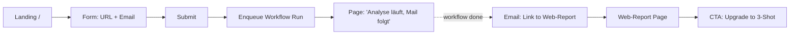
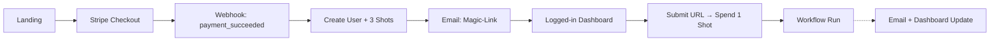
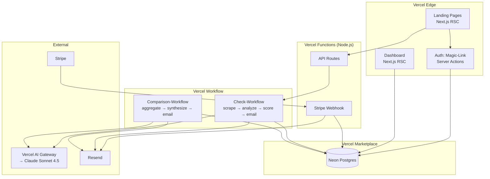
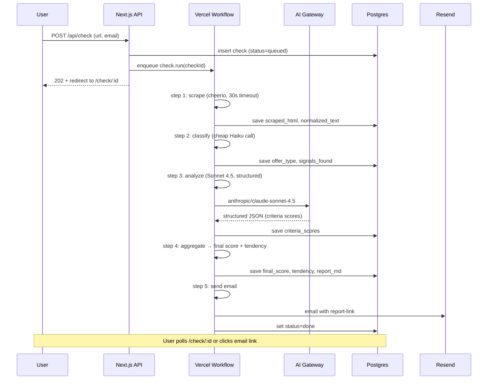

# Snake-Oil-or-Gold Check — MMP Design Spec [ARCHIVED — SUPERSEDED]

> **⚠️ SUPERSEDED 2026-05-20.** This spec is archived for historical reference. The Pricing-Model + Tier-Architecture have been pivoted in the brainstorm session of 2026-05-20 (letter-b). See the canonical replacement: [`docs/superpowers/specs/2026-05-20-tiered-architecture-design.md`](../superpowers/specs/2026-05-20-tiered-architecture-design.md).
>
> **Pivot-Punkte (2026-05-18 → 2026-05-20):**
> 1. **Pricing-Model**: Shot-Bundles (€19 / €49) → ersetzt durch Pay-Per-Shot (€1 / €3) + Monthly Sub (€10) + BYOK
> 2. **Flatrate-Sub**: explicitly excluded in v0.1 → central feature in v0.3 roadmap
> 3. **Account-Mechanik**: Magic-Link Account ab erstem Stripe-Purchase → anonymous-only für Single-Shots, Account erst ab Sub-Tier
> 4. **Free-Shot Mechanik**: 1/Email/30 Tage → 2/Tag/IP mit Email-Gating + Disposable-Detection + Bounce-Check
> 5. **Tier-System**: 3 Tiers (Free + 3-Shot + 10-Shot) → 5+1 Tiers (Examples + Free-Shot + €1 + €3 + €10-Sub + €10-Sub+BYOK [+B2B Roadmap])
> 6. **Modell-Strategie**: Single Anthropic Sonnet → Multi-Model (Gemini Flash für Free-Shot, Haiku für €1, Sonnet für €3, Opus only via BYOK)
>
> **Was aus 2026-05-18-Spec übernommen wurde:**
> - Problem-Statement + Product-Vision (Sections 1-2)
> - Scoring-Framework-Verweise (12 Kriterien, FREE_SHOT_INDICES bereits in Bob's `criteria.ts` implementiert)
> - Defensible-Score-Anforderung (evidence-quote pro Kriterium)
> - User-Trigger-Kontexte (Pre-Purchase, Ad-Confrontation)
>
> Inhalt unten ist Original-Spec von 2026-05-18 zur historischen Referenz, NICHT mehr als aktive Implementations-Grundlage zu lesen.

---

# Snake-Oil-or-Gold Check — MMP Design Spec (Original, 2026-05-18)

**Date:** 2026-05-18
**Status:** Draft v0.1 — SUPERSEDED 2026-05-20
**Owner:** German Rauhut (MASCHIN-Planning)
**Target Launch:** v0.1 in 6-8 Wochen (Full LOW)

---

## 1. Problem Statement

People stand before purchase decisions for online coachings, mentorings, masterclasses, and high-ticket programs (typically 500 € to 10.000 €). They face:

1. **Sophisticated funnels.** Polished sales pages, curated testimonials, urgency tactics, "free webinars" that pitch 5.000 € offers.
2. **Information asymmetry.** Sellers know what they hide; buyers don't know what to ask.
3. **Decision paralysis.** Multiple tabs open, similar-looking offers, no neutral second opinion available without paying another consultant.
4. **Sunk-cost guilt after buying.** "Maybe I just need to apply it harder" — instead of "this was actually weak."

What the market offers today: more coaches selling courses about coaching, Reddit threads with conflicting anecdotes, Trustpilot reviews of dubious origin. **No neutral, fast, cheap, defensible second opinion exists.**

## 2. Product Vision

**Snake-Oil-or-Gold Check** is a neutral, AI-powered reality-check service. A user submits a link to an offer (sales page, funnel URL); the system scrapes public materials, runs them through a structured scoring rubric, and returns a defensible score with:

- Tendency: **Go** / **Vorsicht** / **Lieber lassen**
- 5-15 concrete observations (strengths, weaknesses, warning signals)
- 3-5 recommended next steps for the user

**Positioning:** "Versicherungsschutz" against bad purchases, not another high-ticket coaching. Price feels like a streaming subscription, not consulting fees.

**Differentiator:** Reproducible scoring framework (not vibes). Same input → same score within tolerance. Defensible: each score component traces to evidence on the page.

## 3. MMP Scope (v0.1 — Full LOW)

Three product tiers in v0.1, all automated:

| # | Tier | Price | Volume | Outcome |
|---|------|-------|--------|---------|
| 1 | Free Shot | 0 € | 1 per email / 30 days | Score + 3-5 bullets, web view only |
| 2 | 3-Shot Starter | 19 € (MVP) | 3 checks, 6 months redeem window | Per-check: score, tendency, 5-10 bullets + 1-page comparison report |
| 3 | 10-Shot Power | 49 € (MVP) | 10 checks, 12 months redeem window | Per-check: score, tendency, bullets + shot-history dashboard |

**Not in v0.1:** Flatrate subscription, HIGH-tier (Single-Check / Vergleichscheck / Retainer), DE/EN i18n (DE-only at launch), refund self-service.

## 4. User Flows

### 4.1 Free Shot



**Limits:** 1 Free-Shot per email-hash per 30 days. Rate-limited per IP (5/hour).
**Cost guard:** Free-Shot uses smaller prompt (target ~3000 input tokens / ~800 output).
**Abuse:** If email-hash exists with valid Free-Shot in window → "Du hast diesen Monat schon einen genutzt. Upgrade auf 3-Shot? [CTA]"

### 4.2 3-Shot Starter



**Account creation:** Triggered by Stripe webhook. Account = email + shot-balance. No password. Login via magic-link.
**Shot expiry:** 6 months from purchase. Background cron flags expired shots, no refund (Terms of Service).
**Comparison report:** After 2-3 shots redeemed by same user in the same "campaign", auto-generate 1-page comparison overview (separate workflow).

### 4.3 10-Shot Power

Same as 3-Shot, with:
- 10 shots, 12-month expiry
- Shot-history dashboard (all redeemed shots searchable)
- Re-run option for 1 € extra (re-scrape + re-score same URL after 30 days, useful when offer pricing changes)

## 5. Architecture

### 5.1 Topology



### 5.2 Check-Workflow Steps (durable)



**Retry policy:** Workflow auto-retries each step on transient errors (rate limits, 5xx). Max 3 retries with exponential backoff. After 3 fails: status=failed, user gets error-email with retry-link.

**Cancellation:** User can cancel a running check from dashboard if it's stuck >5 min.

### 5.3 Comparison-Workflow

Triggered when user marks 2-3 checks in dashboard "compare these". Runs as separate workflow:
1. Load all source check results
2. Synthesize comparison via Sonnet 4.5 (matrix prompt)
3. Save comparison report
4. Email user link

## 6. Data Model

```mermaid
erDiagram
    USER ||--o{ SHOT_GRANT : owns
    USER ||--o{ CHECK : initiates
    USER ||--o{ MAGIC_LINK : has
    SHOT_GRANT ||--o{ SHOT : contains
    SHOT ||--o| CHECK : redeems
    CHECK ||--o{ CRITERION_SCORE : breaks_down_to
    CHECK ||--o| REPORT : produces
    COMPARISON ||--o{ CHECK : aggregates

    USER {
        uuid id PK
        text email_hash UK
        text email_plain
        timestamp created_at
        timestamp last_login_at
    }
    SHOT_GRANT {
        uuid id PK
        uuid user_id FK
        enum tier "free|three_shot|ten_shot"
        int quantity
        int remaining
        text stripe_session_id
        timestamp granted_at
        timestamp expires_at
    }
    SHOT {
        uuid id PK
        uuid grant_id FK
        uuid check_id FK_NULLABLE
        timestamp consumed_at
    }
    CHECK {
        uuid id PK
        uuid user_id FK
        text source_url
        enum tier "free|paid"
        enum status "queued|scraping|analyzing|done|failed"
        int final_score "0-100"
        enum tendency "go|caution|skip"
        text workflow_run_id
        timestamp created_at
        timestamp completed_at
    }
    CRITERION_SCORE {
        uuid id PK
        uuid check_id FK
        text criterion_key
        int raw_score "0-10"
        int weighted_score
        text evidence_quote
        text rationale
    }
    REPORT {
        uuid id PK
        uuid check_id FK
        text markdown_body
        text html_rendered
        text pdf_url_NULLABLE
    }
    COMPARISON {
        uuid id PK
        uuid user_id FK
        uuid[] check_ids
        text markdown_body
        timestamp created_at
    }
    MAGIC_LINK {
        uuid id PK
        uuid user_id FK
        text token_hash UK
        timestamp expires_at
        timestamp consumed_at_NULLABLE
    }
```

**Notes:**
- `email_hash` = SHA-256(lowercased email) — used for Free-Shot rate-limit and abuse detection
- `email_plain` stored for delivery only; user can request deletion (GDPR)
- `criterion_key` references rubric in [scoring-framework.md](../../scoring-framework.md)
- All timestamps in UTC, render in user locale on client

## 7. Scoring Framework

**Lives in dedicated doc:** [docs/scoring-framework.md](../../scoring-framework.md).

The score is the product. The doc defines:
- 12 criteria across 4 categories (Substance, Trust, Pricing, Risk)
- Weights per criterion
- 0-10 raw scoring rubric per criterion
- Aggregate → final 0-100 score
- Thresholds for Go (75+) / Vorsicht (45-74) / Lieber lassen (<45)
- Prompt strategy (single multi-criterion call vs per-criterion calls)
- Eval set: 5 known-gold + 5 known-snake-oil + 5 ambiguous offers for calibration
- Calibration plan (re-weight after first 50 real cases)

## 8. Security, Privacy, GDPR

| # | Concern | Mitigation |
|---|---------|-----------|
| 1 | PII storage | Email plain stored only until delivery; hash retained for rate-limit. User-delete endpoint hard-deletes plain + reports |
| 2 | Salespage content | Scraped HTML stored 90 days, then purged (cron). Required for retroactive re-scoring during scoring framework calibration |
| 3 | Stripe data | We never store card data — Stripe Checkout Sessions only. We store session_id + customer_id for reconciliation |
| 4 | AI processing | Vercel AI Gateway with `provider_options.anthropic.zero_data_retention: true` |
| 5 | Magic-link tokens | SHA-256 stored, plain emitted to email only, 15-minute expiry, single-use |
| 6 | Defamation risk | Reports include disclaimer: "Bewertung basiert auf öffentlich zugänglichen Materialien. Keine Aussage über Personen. Diese Einschätzung ist Meinungsäußerung, kein Urteil." |
| 7 | DDoS / abuse | Vercel BotID on Free-Shot form, IP rate-limit (5/h), email-hash rate-limit (1/30d Free) |
| 8 | Cookie/Tracking | Vercel Web Analytics (cookieless). No consent banner needed |

**Imprint, Privacy Policy, Terms:** Required at launch. Boilerplate adapted from neckarshore-website + lawyer review before v0.1 ships.

## 9. Operational Concerns

### 9.1 Cost Model (per check)

Rough estimate per Free-Shot (smaller scope):
- Scraping: ~0.01 € (Vercel fluid CPU)
- Claude Sonnet 4.5: ~3k input + 800 output tokens → ~0.015 €
- Storage + DB: negligible
- Email: ~0.0004 €
- **Per Free-Shot: ~0.025 €**

Per Paid-Shot (full analysis, ~8k input / 2k output):
- ~0.05 € per shot at gateway pricing
- **3-Shot pack at 19 €**: revenue 19 €, AI cost 0.15 €, Stripe fee ~0.85 €, gross margin ~95%
- **10-Shot pack at 49 €**: revenue 49 €, AI cost 0.50 €, Stripe fee ~2 €, gross margin ~95%

Comfortable. Free-Shot abuse: 1000 abusive Free-Shots/month = 25 €. Tolerable.

### 9.2 Monitoring

- Vercel Observability (Functions, Workflow runs)
- Sentry (errors)
- Daily metric digest via email-cron: shots issued, shots redeemed, conversion rate Free → Paid, top-of-funnel page views
- Workflow-failure alert (Sentry): >5 failures in 1h → immediate ping

### 9.3 Quality Gate

For first 50 paid checks: human-in-the-loop review BEFORE email delivery. Workflow pauses, sends Slack DM "review check #N", manual approve → email sent. After 50 successful auto-quality checks: switch to spot-check only (10% sample).

Implemented as Workflow step with `await humanApproval()`.

## 10. Success Criteria (v0.1 Launch)

v0.1 ships when ALL of these hold:

1. **Functionality:** Free-Shot + 3-Shot + 10-Shot end-to-end work in production
2. **Quality:** Scoring framework calibrated on eval set; 80%+ agreement with user-labeled "gold/snake-oil" baselines
3. **Tests:** Vitest unit ≥80% coverage on `lib/`, Playwright E2E for 5 critical flows (Free-Shot submit, Stripe purchase, Shot-redeem, Magic-Link auth, Dashboard view)
4. **Performance:** Landing Lighthouse 95+ desktop/mobile; Free-Shot completion <5min p95
5. **Legal:** Imprint, Privacy, Terms in place; lawyer sign-off
6. **Cost:** Per-check cost <0.10 € confirmed in staging-load-test
7. **Pilot:** 5 pilot users have run 3-Shot end-to-end and given feedback (Quality, Clarity, "would pay again?")
8. **Decision:** User explicitly says "PASS" — MASCHIN never auto-marks "done"

## 11. Open Questions / Risks

| # | Item | Risk Class | Resolution Plan |
|---|------|------------|-----------------|
| 1 | Domain name (`snakeoilcheck.com`?) | Blocks Stripe Checkout branding + email-sender SPF/DKIM | Decide before v0.1 build phase 4 (Stripe + Auth, Week 3-4) |
| 2 | Calibration data | Scoring quality risk | Collect 15 eval cases (5 gold / 5 snake-oil / 5 ambiguous) before first paid shot ships |
| 3 | Salespage scraping JS-heavy sites | Some funnels are SPA / require JS | v0.1: cheerio + fetch. If >20% of submissions fail → add Playwright headless fallback in v0.2 |
| 4 | Legal — defamation | Reputation/legal risk | Disclaimer in every report, lawyer review of one full report sample |
| 5 | Refund policy | Trust signal | "30-day money-back on unused shots" — manual handling via Stripe Dashboard, codified in Terms |
| 6 | Stripe-Webhook idempotency | Double-grant risk on retried webhooks | Idempotency key on `stripe_session_id` unique constraint |
| 7 | Free-Shot ↔ Paid conversion rate | Business model risk | Target 5%+ Free→Paid. If <2% after 200 Free-Shots → re-design CTA/upsell |
| 8 | Magic-link deliverability | Auth flow risk | Resend with proper SPF/DKIM, fallback "resend link" CTA |

## 12. Out of Scope (v0.1)

- Flatrate subscription (v0.2)
- HIGH-tier (Single-Check / Vergleichscheck / Retainer) (v0.3)
- English language (v0.2)
- Mobile apps
- Native PDF download (web report + email link only in v0.1)
- Refund self-service (manual via Stripe Dashboard)
- Account password / 2FA (magic-link only)
- Affiliate / referral program
- Public score-API for partners
- Browser extension

## 13. Build Sequence (v0.1 phases — even though we ship all at once)

Build order, NOT separate launches:

1. **Foundation (Week 1):** Next.js scaffold, Vercel deploy, Postgres schema, Drizzle migrations, vercel.ts config, CI/CD
2. **AI + Workflow (Week 1-2):** Scraping module, AI Gateway integration, scoring rubric in code, Workflow steps wired up
3. **Free-Shot flow (Week 2-3):** Landing, form, abuse-limits, email delivery, web-report page
4. **Stripe + Auth (Week 3-4):** Magic-link auth, Stripe Checkout, webhooks, user/shot creation
5. **Dashboard + Paid Flows (Week 4-5):** Shot redemption, history, comparison flow, 10-Shot dashboard
6. **Scoring Calibration (Week 5-6):** Run 15 eval cases, calibrate weights, write rationale docs
7. **Legal + Hardening (Week 6-7):** Imprint, Privacy, Terms, BotID, rate-limits, monitoring, Sentry
8. **Pilot + Polish (Week 7-8):** 5 pilot users, feedback iteration, copy polish, Lighthouse pass

## 14. References

- Vault source: `Idea - Snakeoil or Gold 25-12/40 - Produktpakete & MVP Snakeoil LOW.md`
- Pricing model: `Idea - Snakeoil or Gold 25-12/50 - Pricing & Monetarisierung - Snakeoil LOW.md`
- Marketing positioning: `Idea - Snakeoil or Gold 25-12/Marketing of "Snake-Oil-OrGold Check".md`
- Sibling MMP for pattern: `~/Developer/projects/neckarshore-ai/mmp-prod-or-pretend/`
- Scoring detail: [`docs/scoring-framework.md`](../../scoring-framework.md)
- Roadmap: [`docs/roadmap.md`](../../roadmap.md)
- Decisions: [`docs/decisions.md`](../../decisions.md)
