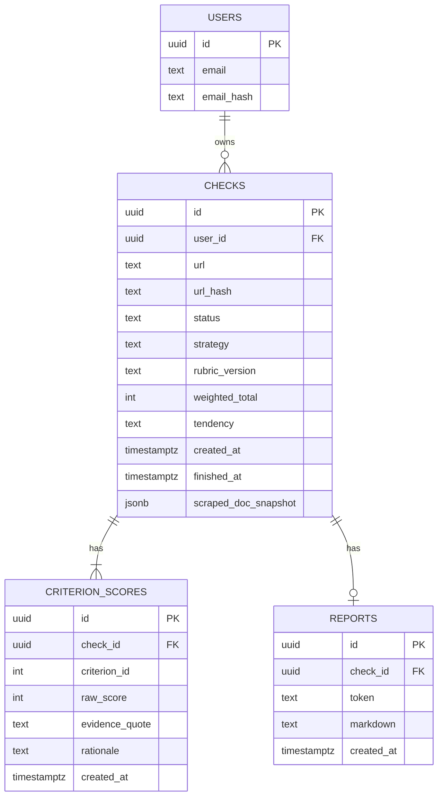
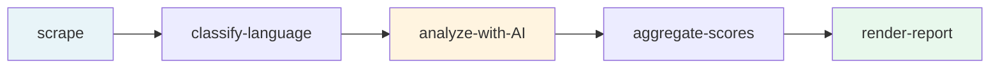

# Phase 2 — AI + Workflow Backbone Implementation Plan

> **For agentic workers:** REQUIRED SUB-SKILL: Use superpowers:subagent-driven-development (recommended) or superpowers:executing-plans to implement this plan task-by-task. Steps use checkbox (`- [ ]`) syntax for tracking.

**Goal:** Build the AI analysis pipeline end-to-end as a durable Vercel Workflow: a check submitted with a URL produces a saved `Check` row with scored `criterion_scores` and a rendered Markdown report, with retries and observability. Resolve the **§8 #1 design-decision** (single-call vs per-criterion prompting) empirically against a 5-URL eval-set as Task 5 before locking the production prompting strategy.

**Architecture:** Vercel AI Gateway (provider-string routing) → Anthropic Claude Sonnet 4.5 with structured-output JSON Schema. Vercel Workflow DevKit for the durable 5-step pipeline. Drizzle migrations add 3 new tables (`checks`, `criterion_scores`, `reports`). Scraping via `fetch` + `cheerio` with a hard input-cap of 50k chars pre-AI. Scoring rubric is **the product** (per `scoring-framework.md`): every criterion produces a raw score, a verbatim evidence quote, and a 1-2 sentence rationale.

**Tech Stack additions (delta on Phase 1):**

| # | Package | Version | Role |
|---|---------|---------|------|
| 1 | `@vercel/workflow` | 0.5.x (latest stable as of 2026-05-19) | Durable step-based execution + retries + replay |
| 2 | `ai` | 4.0.x | Vercel AI SDK core (provider abstraction + `generateObject` for structured output) |
| 3 | `@ai-sdk/anthropic` | 1.0.x | Anthropic provider for the AI SDK (used through AI Gateway routing) |
| 4 | `cheerio` | 1.0.0 | HTML parsing for scraping module |
| 5 | `p-retry` | 6.2.x | Backoff helper for `fetch` retries inside the scraping module |
| 6 | `tsx` | 4.19.x | Already-present-via-Vitest? Add to scripts/ runners if missing |

(Phase 1 already pinned: Next.js 16, React 19, TypeScript 5.7, Drizzle 0.36, pg 8.13, Zod 3.23, Vitest 3, Playwright 1.48, Biome 1.9, pnpm 10.)

**Prerequisites (must hold before Phase 0 Pre-Flight passes):**

- Phase 1 = **Done** (PR #1 merged 2026-05-18, CI green on main, `/api/health` live, Neon DB reachable in production).
- Vercel project `snakeoil-check` linked + production deploy active.
- An Anthropic API key with a **Spend-Cap** (per AD-33 in `omnopsis-planning`) named per the canonical convention (e.g. `anthropic_api_key_neckarshore_tools` or analogous). The key must be present in the **Vercel project env (production + preview)** as `ANTHROPIC_API_KEY`. **MASCHIN orchestrates the swap; User confirms Spend-Cap exists in Console.**
- Vercel AI Gateway **enabled at the team or project level** so provider-string `"anthropic/claude-sonnet-4.5"` resolves through the Gateway (not direct Anthropic). Gateway gives cost-tracking + provider-failover at zero code cost.

**Working-Dir Discipline:** Every Bash command starts with `cd ~/Developer/projects/neckarshore-ai/snakeoil-check && ...`.

---

## §8 #1 Design-Decision Framing (read before Task 5)

The spec has an internal contradiction that this plan resolves empirically:

| Source | Says |
|--------|------|
| `scoring-framework.md` §4 "Prompt Strategy" | "**Approach: Single multi-criterion call** (not 12 separate calls)" — framed as locked. |
| `scoring-framework.md` §8 #1 "Open Questions" | "Benchmark both on 5 eval cases. If quality difference <5pt and latency favorable → multi. Decide before v0.1 ship." |

The **prior** is single-call (per §4 reasoning: ~70% token savings via shared context, ~10-15s vs 60s latency, consistency from full-document context for all 12 criteria). The **benchmark's job (Task 5)** is to **falsify the single-call prior**, not pick a winner from scratch — there are no ground-truth labels yet (those come in Phase 6 Calibration). The benchmark measures **inter-strategy disagreement** on the same 5 URLs:

- If **disagreement ≤ 5pt average** across 12 criteria → single-call wins (prior holds, cost/latency favor it).
- If **disagreement > 5pt average** → **STOP, investigate which strategy is hallucinating** by spot-checking evidence quotes. Do NOT auto-pick per-criterion. The disagreement is data, not a verdict.

After Task 5 ships, `scoring-framework.md` §4 gets updated with the empirical anchor (commit in Task 5 part B). This resolves the internal contradiction in the same PR that runs the benchmark.

---

## Task 1: Phase 0 Pre-Flight + Eval-Set Bootstrap

**Files:**
- Create: `docs/eval-set-phase-2.md` (5 manually-labeled eval URLs)
- Edit: `package.json` (add 6 packages)
- Create: `.env.example` (add new keys + AI Gateway note)
- Create: `scripts/probe-ai-gateway.ts`

- [ ] **Step 1.1: Verify Phase 1 acceptance gate**

```bash
cd ~/Developer/projects/neckarshore-ai/snakeoil-check && \
  git fetch origin main && \
  git rev-parse origin/main && \
  gh run list --branch main --limit 1 --json status,conclusion && \
  curl -sf https://snakeoil-check.vercel.app/api/health | head -1
```

Expected: HEAD on origin/main matches PR #1 merge commit `c76a885`. Latest run on main: `completed/success`. Health endpoint returns `{"status":"ok","db":"reachable"}`.

If any of the three checks fail: STOP. Fix Phase 1 before continuing.

- [ ] **Step 1.2: Verify `ANTHROPIC_API_KEY` available to Vercel project**

```bash
cd ~/Developer/projects/neckarshore-ai/snakeoil-check && \
  vercel env ls production | grep -i ANTHROPIC
```

Expected line: `ANTHROPIC_API_KEY        Encrypted        production        [age]`

If missing: User-action via canonical pipe-pattern from AD-33 (NEVER paste literal key into chat or any file):

```bash
security find-generic-password -a "$USER" -s anthropic_api_key_tools -w \
  | vercel env add ANTHROPIC_API_KEY production --force
security find-generic-password -a "$USER" -s anthropic_api_key_tools -w \
  | vercel env add ANTHROPIC_API_KEY preview --force
```

(Replace `anthropic_api_key_tools` with the actual keychain entry name per AD-33 naming convention.)

- [ ] **Step 1.3: Verify Vercel AI Gateway routing for the project**

```bash
cd ~/Developer/projects/neckarshore-ai/snakeoil-check && \
  vercel env ls production | grep -iE "AI_GATEWAY|VERCEL_OIDC"
```

The AI Gateway auto-injects `VERCEL_OIDC_TOKEN` and routes provider-strings transparently when the Anthropic key is present at the project. If neither var appears: surface to User — "Visit Vercel team → AI → Gateway, ensure Anthropic provider is enabled, then redeploy preview."

**Acceptance criterion:** the probe script in Step 1.5 returns a real Claude Sonnet response.

- [ ] **Step 1.4: Install new runtime dependencies (exact versions)**

```bash
cd ~/Developer/projects/neckarshore-ai/snakeoil-check && pnpm add --save-exact \
  @vercel/workflow@0.5.4 \
  ai@4.0.18 \
  @ai-sdk/anthropic@1.0.4 \
  cheerio@1.0.0 \
  p-retry@6.2.1
```

(Versions illustrative-at-write-time; implementer pins latest stable per `pnpm view <pkg> version`, captures exact versions in commit body.)

- [ ] **Step 1.5: Write AI-Gateway probe script**

Create `scripts/probe-ai-gateway.ts`:

```typescript
import { generateText } from "ai";
import { anthropic } from "@ai-sdk/anthropic";

async function main() {
  const { text } = await generateText({
    model: anthropic("claude-sonnet-4.5"),
    prompt: "Return exactly the word OK and nothing else.",
    temperature: 0,
  });
  console.log(JSON.stringify({ ok: text.trim() === "OK", raw: text }));
}

main().catch((err) => {
  console.error(JSON.stringify({ ok: false, error: String(err) }));
  process.exit(1);
});
```

Run via:

```bash
cd ~/Developer/projects/neckarshore-ai/snakeoil-check && \
  pnpm tsx scripts/probe-ai-gateway.ts
```

Expected: `{"ok":true,"raw":"OK"}`. If this fails: Phase 2 cannot proceed — diagnose via Vercel Gateway logs + AD-33 rotation-checklist (`omnopsis-planning:docs/backlog/ideas.md` § AD-33 Rotation-Event-Checklist Follow-Up).

- [ ] **Step 1.6: Bootstrap the 5-URL eval-set**

The benchmark in Task 5 needs 5 manually-labeled URLs. Per `scoring-framework.md` §6.1, the long-term eval-set is 15 URLs (5 Gold + 5 Snake-Oil + 5 Ambiguous). Phase 2 bootstraps **a minimal representative subset of 5**:

| # | Bucket | Count | Selection criterion |
|---|--------|-------|---------------------|
| 1 | Known Gold | 2 | Established providers with clear pricing + named methodology + visible refund policy |
| 2 | Known Snake-Oil | 2 | Public-callout targets OR known German coaching with hidden price + lottery-style income claims |
| 3 | Ambiguous | 1 | A real-world German coaching offer where reasonable people disagree |

Create `docs/eval-set-phase-2.md`:

```markdown
# Phase 2 Benchmark Eval-Set (5 URLs)

**Purpose:** Empirical resolution of `scoring-framework.md` §8 #1 (single-call vs per-criterion). NOT full calibration — that is Phase 6 with 15 URLs and labels.

**Labelling rule:** Each URL gets an `expected_score_range` (low-high) per reviewer judgment using the §3 rubric. URLs picked **before** any AI run to prevent rubric-gaming.

| # | Bucket | URL | Expected range | Why chosen |
|---|--------|-----|----------------|------------|
| 1 | Gold | <TBD-A> | 75-95 | <one-line> |
| 2 | Gold | <TBD-B> | 75-95 | <one-line> |
| 3 | Snake-Oil | <TBD-C> | 5-30 | <one-line> |
| 4 | Snake-Oil | <TBD-D> | 5-30 | <one-line> |
| 5 | Ambiguous | <TBD-E> | 35-65 | <one-line> |

**Sourcing:** German Rauhut hand-picks the 5 URLs before Task 5 runs. Each line filled in this file with concrete URL + range + rationale.
```

The implementing agent prompts the User for URL choices when Task 5 starts (these can be picked any time between Task 1.6 and Task 5.1 — not blocking on Tasks 2-4).

- [ ] **Step 1.7: Update `.env.example` with new keys**

Edit `.env.example` (or create if missing):

```
# Database (Phase 1)
DATABASE_URL=
POSTGRES_URL_NON_POOLING=

# AI (Phase 2)
ANTHROPIC_API_KEY=
# Note: production reads from Vercel-env injected through AI Gateway.
# Local dev reads from this file — populated via pipe-pattern (per AD-33):
#   security find-generic-password -a "$USER" -s anthropic_api_key_tools -w
# NEVER paste literal keys into this file.
```

- [ ] **Step 1.8: Commit Task 1**

```bash
cd ~/Developer/projects/neckarshore-ai/snakeoil-check && \
  git add package.json pnpm-lock.yaml scripts/probe-ai-gateway.ts docs/eval-set-phase-2.md .env.example && \
  git commit -m "phase-2(task-1): pre-flight + eval-set bootstrap

- Add 5 runtime deps (@vercel/workflow, ai, @ai-sdk/anthropic, cheerio, p-retry)
- scripts/probe-ai-gateway.ts smoke-test: returns OK via Anthropic/Sonnet via Gateway
- docs/eval-set-phase-2.md: 5-URL benchmark slot template
- .env.example: ANTHROPIC_API_KEY documented, pipe-pattern referenced (AD-33)

Pre-Flight gates passed:
- origin/main = c76a885 (Phase 1 merged)
- /api/health: ok
- vercel env has ANTHROPIC_API_KEY production+preview
- probe-ai-gateway.ts returns ok=true"
```

---

## Task 2: Scoring Rubric Encoded in TypeScript

**Files:**
- Create: `src/lib/scoring/criteria.ts`
- Create: `src/lib/scoring/schema.ts`
- Create: `src/lib/scoring/types.ts`
- Create: `src/lib/scoring/__tests__/criteria.test.ts`

**Why before scraping/AI:** the rubric is the **product**. Everything downstream consumes its shape. Encode the 12 criteria from `scoring-framework.md` §2 + §3 as a typed, frozen array. Generate the Zod schema for the AI's structured output from the same source. **One source of truth.**

- [ ] **Step 2.1: Types**

Create `src/lib/scoring/types.ts`:

```typescript
export type Pillar = "substance" | "trust" | "pricing" | "risk";

export interface Criterion {
  readonly id: number;          // 1..12
  readonly pillar: Pillar;
  readonly name: string;
  readonly weight: number;       // 4..9 per §2
  readonly rubricRef: string;    // e.g. "§3.1" — points back to scoring-framework.md
  readonly inFreeShot: boolean;  // true for IDs in [1, 4, 7, 10, 11] per §4 Free-Shot
}

export interface CriterionScore {
  readonly criterionId: number;
  readonly rawScore: number;         // 0..10 per rubric
  readonly evidenceQuote: string;    // verbatim or "[no statement found]"
  readonly rationale: string;        // 1-2 sentences
}

export interface CheckScore {
  readonly url: string;
  readonly rubricVersion: string;    // semver, see §7
  readonly criterionScores: ReadonlyArray<CriterionScore>;
  readonly weightedTotal: number;
  readonly tendency: "Go" | "Vorsicht" | "Lieber lassen";
  readonly modelStrategy: "single-call" | "per-criterion";
  readonly latencyMs: number;
  readonly costEur: number;
}
```

- [ ] **Step 2.2: Frozen criterion table**

Create `src/lib/scoring/criteria.ts`:

```typescript
import type { Criterion } from "./types";

const FREE_SHOT_IDS = new Set<number>([1, 4, 7, 10, 11]);

export const CRITERIA: ReadonlyArray<Criterion> = Object.freeze([
  { id: 1,  pillar: "substance", name: "Specificity of Promises",      weight: 8, rubricRef: "§3.1",  inFreeShot: FREE_SHOT_IDS.has(1)  },
  { id: 2,  pillar: "substance", name: "Methodology Transparency",     weight: 7, rubricRef: "§3.2",  inFreeShot: FREE_SHOT_IDS.has(2)  },
  { id: 3,  pillar: "substance", name: "Outcome Measurability",        weight: 6, rubricRef: "§3.3",  inFreeShot: FREE_SHOT_IDS.has(3)  },
  { id: 4,  pillar: "trust",     name: "Provider Track Record",        weight: 8, rubricRef: "§3.4",  inFreeShot: FREE_SHOT_IDS.has(4)  },
  { id: 5,  pillar: "trust",     name: "Testimonial Authenticity",     weight: 7, rubricRef: "§3.5",  inFreeShot: FREE_SHOT_IDS.has(5)  },
  { id: 6,  pillar: "trust",     name: "Independent Verifiability",    weight: 6, rubricRef: "§3.6",  inFreeShot: FREE_SHOT_IDS.has(6)  },
  { id: 7,  pillar: "pricing",   name: "Price-to-Value Transparency",  weight: 8, rubricRef: "§3.7",  inFreeShot: FREE_SHOT_IDS.has(7)  },
  { id: 8,  pillar: "pricing",   name: "Refund / Cancellation Policy", weight: 5, rubricRef: "§3.8",  inFreeShot: FREE_SHOT_IDS.has(8)  },
  { id: 9,  pillar: "pricing",   name: "Pricing-Logic Coherence",      weight: 5, rubricRef: "§3.9",  inFreeShot: FREE_SHOT_IDS.has(9)  },
  { id: 10, pillar: "risk",      name: "Urgency / Pressure Tactics",   weight: 7, rubricRef: "§3.10", inFreeShot: FREE_SHOT_IDS.has(10) },
  { id: 11, pillar: "risk",      name: "Income / Outcome Claims",      weight: 9, rubricRef: "§3.11", inFreeShot: FREE_SHOT_IDS.has(11) },
  { id: 12, pillar: "risk",      name: "Target-Audience Specificity",  weight: 4, rubricRef: "§3.12", inFreeShot: FREE_SHOT_IDS.has(12) },
] satisfies ReadonlyArray<Criterion>);

export const MAX_RAW_SCORE = 10;
export const MAX_WEIGHTED_TOTAL = CRITERIA.reduce((sum, c) => sum + c.weight * MAX_RAW_SCORE, 0); // 800

export const RUBRIC_VERSION = "0.1.0" as const;

export function tendencyFor(weightedTotal0to100: number): "Go" | "Vorsicht" | "Lieber lassen" {
  if (weightedTotal0to100 >= 75) return "Go";
  if (weightedTotal0to100 >= 45) return "Vorsicht";
  return "Lieber lassen";
}

export function computeWeightedTotal(scores: ReadonlyArray<{ criterionId: number; rawScore: number }>): number {
  const weighted = scores.reduce((sum, s) => {
    const c = CRITERIA.find((x) => x.id === s.criterionId);
    if (!c) throw new Error(`Unknown criterion id ${s.criterionId}`);
    return sum + s.rawScore * c.weight;
  }, 0);
  return (weighted / MAX_WEIGHTED_TOTAL) * 100;
}
```

- [ ] **Step 2.3: Zod schema for AI structured output**

Create `src/lib/scoring/schema.ts`:

```typescript
import { z } from "zod";
import { CRITERIA } from "./criteria";

const CRITERION_IDS = CRITERIA.map((c) => c.id) as ReadonlyArray<number>;

export const CriterionScoreSchema = z.object({
  criterion_id: z.number().int().refine((n) => CRITERION_IDS.includes(n), {
    message: `criterion_id must be one of ${CRITERION_IDS.join(",")}`,
  }),
  raw_score: z.number().int().min(0).max(10),
  evidence_quote: z.string().min(1).max(400),
  rationale: z.string().min(1).max(400),
});

export const FullCheckSchema = z.object({
  criteria: z.array(CriterionScoreSchema).length(CRITERIA.length),
});

export const FreeShotCheckSchema = z.object({
  criteria: z.array(CriterionScoreSchema).length(CRITERIA.filter((c) => c.inFreeShot).length), // 5
});
```

The `length(...)` constraint enforces the AI returns **all 12 criteria** (or all 5 for Free-Shot). The validation step in Task 7 also checks `evidence_quote` is non-empty per §4.

- [ ] **Step 2.4: Unit tests**

Create `src/lib/scoring/__tests__/criteria.test.ts`:

```typescript
import { describe, expect, it } from "vitest";
import { CRITERIA, MAX_WEIGHTED_TOTAL, RUBRIC_VERSION, computeWeightedTotal, tendencyFor } from "../criteria";

describe("scoring criteria table", () => {
  it("has 12 criteria with unique IDs 1..12", () => {
    expect(CRITERIA).toHaveLength(12);
    const ids = CRITERIA.map((c) => c.id).sort((a, b) => a - b);
    expect(ids).toEqual([1, 2, 3, 4, 5, 6, 7, 8, 9, 10, 11, 12]);
  });

  it("has exactly 5 criteria flagged for Free-Shot (IDs 1, 4, 7, 10, 11)", () => {
    const freeShotIds = CRITERIA.filter((c) => c.inFreeShot).map((c) => c.id).sort((a, b) => a - b);
    expect(freeShotIds).toEqual([1, 4, 7, 10, 11]);
  });

  it("total weight = 80 per §2", () => {
    const totalWeight = CRITERIA.reduce((sum, c) => sum + c.weight, 0);
    expect(totalWeight).toBe(80);
  });

  it("MAX_WEIGHTED_TOTAL = 800 (80 * 10)", () => {
    expect(MAX_WEIGHTED_TOTAL).toBe(800);
  });

  it("RUBRIC_VERSION is semver-shaped", () => {
    expect(RUBRIC_VERSION).toMatch(/^\d+\.\d+\.\d+$/);
  });
});

describe("tendencyFor", () => {
  it("buckets per §1: >=75 Go, 45-74 Vorsicht, <45 Lieber lassen", () => {
    expect(tendencyFor(100)).toBe("Go");
    expect(tendencyFor(75)).toBe("Go");
    expect(tendencyFor(74)).toBe("Vorsicht");
    expect(tendencyFor(45)).toBe("Vorsicht");
    expect(tendencyFor(44)).toBe("Lieber lassen");
    expect(tendencyFor(0)).toBe("Lieber lassen");
  });
});

describe("computeWeightedTotal", () => {
  it("returns 100 when every criterion scores 10", () => {
    const allTens = CRITERIA.map((c) => ({ criterionId: c.id, rawScore: 10 }));
    expect(computeWeightedTotal(allTens)).toBe(100);
  });

  it("returns 0 when every criterion scores 0", () => {
    const allZeros = CRITERIA.map((c) => ({ criterionId: c.id, rawScore: 0 }));
    expect(computeWeightedTotal(allZeros)).toBe(0);
  });

  it("throws on unknown criterion id", () => {
    expect(() => computeWeightedTotal([{ criterionId: 999, rawScore: 5 }])).toThrow();
  });
});
```

Run tests:

```bash
cd ~/Developer/projects/neckarshore-ai/snakeoil-check && pnpm test src/lib/scoring/
```

Expected: all green. **If any test fails: STOP, do not move to Task 3.** The rubric is the product; getting its shape right is non-negotiable.

- [ ] **Step 2.5: Commit Task 2**

```bash
cd ~/Developer/projects/neckarshore-ai/snakeoil-check && \
  git add src/lib/scoring/ && \
  git commit -m "phase-2(task-2): scoring rubric encoded in TypeScript

- criteria.ts: frozen 12-criterion table per scoring-framework.md §2
- types.ts: Criterion / CriterionScore / CheckScore shapes
- schema.ts: Zod schema for AI structured output (full + free-shot variants)
- criteria.test.ts: 7 unit tests

RUBRIC_VERSION=0.1.0 (semver-bumped when rubric changes per §7)
MAX_WEIGHTED_TOTAL=800 (sum of weights × 10)"
```

---

## Task 3: Scraping Module

**Files:**
- Create: `src/lib/scraping/fetch-html.ts`
- Create: `src/lib/scraping/normalize.ts`
- Create: `src/lib/scraping/index.ts`
- Create: `src/lib/scraping/__tests__/fetch-html.test.ts`
- Create: `src/lib/scraping/__tests__/normalize.test.ts`
- Create: `src/lib/scraping/__fixtures__/sample-coaching.html`
- Create: `src/lib/scraping/__fixtures__/sample-saas.html`

**Behavior:** Given a URL, fetch the HTML with retries + a 30s hard timeout + a 5 MB hard size cap. Parse with cheerio. Extract title, h1-h3, body text (50k char cap), testimonial blocks (by class match + heading-sibling), pricing mentions (€/EUR/$/USD regex).

The **50k char cap pre-AI** is intentional: Sonnet 4.5 context is 200k tokens but cost grows linearly. 50k chars ≈ 12k tokens of input, leaves 188k for output + schema. Realistic salespages fit.

- [ ] **Step 3.1: HTTP fetch with retries + caps**

Create `src/lib/scraping/fetch-html.ts`:

```typescript
import pRetry from "p-retry";

const FETCH_TIMEOUT_MS = 30_000;
const MAX_SIZE_BYTES = 5 * 1024 * 1024; // 5 MB
const USER_AGENT = "Mozilla/5.0 (compatible; SnakeOilCheck/0.1; +https://snakeoil-check.vercel.app)";

export interface FetchResult {
  url: string;          // final URL after redirects
  status: number;
  html: string;
  byteCount: number;
  truncated: boolean;
}

export class FetchError extends Error {
  constructor(msg: string, readonly cause?: unknown) {
    super(msg);
    this.name = "FetchError";
  }
}

export async function fetchHtml(input: string): Promise<FetchResult> {
  return pRetry(
    async () => {
      const controller = new AbortController();
      const timer = setTimeout(() => controller.abort(), FETCH_TIMEOUT_MS);
      try {
        const res = await fetch(input, {
          headers: { "user-agent": USER_AGENT, accept: "text/html,application/xhtml+xml" },
          redirect: "follow",
          signal: controller.signal,
        });
        if (!res.ok) throw new FetchError(`status ${res.status} for ${input}`);
        const ct = res.headers.get("content-type") ?? "";
        if (!/text\/html|application\/xhtml/i.test(ct)) {
          throw new FetchError(`non-HTML content-type "${ct}"`);
        }
        const body = await res.arrayBuffer();
        const truncated = body.byteLength >= MAX_SIZE_BYTES;
        const html = new TextDecoder("utf-8", { fatal: false }).decode(
          truncated ? body.slice(0, MAX_SIZE_BYTES) : body
        );
        return { url: res.url, status: res.status, html, byteCount: body.byteLength, truncated };
      } finally {
        clearTimeout(timer);
      }
    },
    { retries: 2, minTimeout: 500, factor: 2 }
  );
}
```

- [ ] **Step 3.2: Normalize**

Create `src/lib/scraping/normalize.ts`:

```typescript
import * as cheerio from "cheerio";

const BODY_TEXT_CAP = 50_000;

export interface NormalizedDoc {
  url: string;
  title: string;
  headings: string[];
  bodyText: string;
  testimonialBlocks: string[];
  pricingMentions: string[];
  charCount: number;
  truncated: boolean;
}

const PRICING_RE = /(\d{1,4}(?:[.,]\d{2})?)\s*(?:€|EUR|\$|USD)/g;
const TESTIMONIAL_CLASS_RE = /testimonial|bewertung|kundenstimme|quote/i;
const TESTIMONIAL_HEADING_RE = /stimmen|reviews?|testimonial|kundenmeinungen/i;

function collapseWhitespace(s: string): string {
  return s.replace(/\s+/g, " ").trim();
}

export function normalize(html: string, sourceUrl: string): NormalizedDoc {
  const $ = cheerio.load(html);

  // Strip noise
  $("script, style, noscript, nav, footer, iframe, svg").remove();

  const title = collapseWhitespace($("title").first().text() || $("h1").first().text() || "");

  const headings: string[] = [];
  $("h1, h2, h3").each((_, el) => {
    const t = collapseWhitespace($(el).text());
    if (t) headings.push(t);
  });

  // Testimonial blocks
  const tb = new Set<string>();
  $(`[class]`).each((_, el) => {
    const cls = $(el).attr("class") ?? "";
    if (TESTIMONIAL_CLASS_RE.test(cls)) {
      const t = collapseWhitespace($(el).text());
      if (t.length >= 20 && t.length <= 1000) tb.add(t);
    }
  });
  $("h1, h2, h3").each((_, el) => {
    if (TESTIMONIAL_HEADING_RE.test($(el).text())) {
      $(el).nextAll("blockquote, p").slice(0, 6).each((_, sib) => {
        const t = collapseWhitespace($(sib).text());
        if (t.length >= 20 && t.length <= 1000) tb.add(t);
      });
    }
  });

  // Body text
  let bodyText = collapseWhitespace($("body").text());
  const charCount = bodyText.length;
  const truncated = charCount > BODY_TEXT_CAP;
  if (truncated) bodyText = bodyText.slice(0, BODY_TEXT_CAP);

  // Pricing mentions — iterate via matchAll (idiomatic, no manual lastIndex management)
  const pricing = new Set<string>();
  for (const match of bodyText.matchAll(PRICING_RE)) {
    pricing.add(match[0]);
    if (pricing.size >= 50) break;
  }

  return {
    url: sourceUrl,
    title,
    headings,
    bodyText,
    testimonialBlocks: Array.from(tb).slice(0, 30),
    pricingMentions: Array.from(pricing),
    charCount,
    truncated,
  };
}
```

- [ ] **Step 3.3: Index re-export**

Create `src/lib/scraping/index.ts`:

```typescript
export { fetchHtml, FetchError } from "./fetch-html";
export type { FetchResult } from "./fetch-html";
export { normalize } from "./normalize";
export type { NormalizedDoc } from "./normalize";
```

- [ ] **Step 3.4: Fixtures**

Create `src/lib/scraping/__fixtures__/sample-coaching.html` — a 200-400-line representative German coaching landing page (title, h1-h3, testimonials in `<div class="testimonial">` blocks, prices in `€` format, footer with Impressum-link). Generic placeholder names only ("Anna M.", "Max Beispiel"). No real PII.

Create `src/lib/scraping/__fixtures__/sample-saas.html` — SaaS-style landing (no testimonial class, prices in `$`, longer body, multiple H2 sections).

**Authoring rule:** fixtures are static HTML strings checked into git. They MUST NOT contain real personal data or trademarked content beyond fair-use snippets.

- [ ] **Step 3.5: Unit tests for `normalize`**

Create `src/lib/scraping/__tests__/normalize.test.ts`:

```typescript
import { describe, expect, it } from "vitest";
import { readFileSync } from "node:fs";
import path from "node:path";
import { normalize } from "../normalize";

const fixturesDir = path.join(__dirname, "..", "__fixtures__");
const coaching = readFileSync(path.join(fixturesDir, "sample-coaching.html"), "utf-8");
const saas = readFileSync(path.join(fixturesDir, "sample-saas.html"), "utf-8");

describe("normalize: coaching fixture", () => {
  const doc = normalize(coaching, "https://example.test/coach");

  it("extracts a non-empty title", () => {
    expect(doc.title.length).toBeGreaterThan(3);
  });

  it("extracts at least 3 headings", () => {
    expect(doc.headings.length).toBeGreaterThanOrEqual(3);
  });

  it("finds testimonial blocks via class match", () => {
    expect(doc.testimonialBlocks.length).toBeGreaterThanOrEqual(1);
  });

  it("finds pricing mentions in € format", () => {
    expect(doc.pricingMentions.some((p) => p.includes("€"))).toBe(true);
  });

  it("body text is bounded by the 50k cap", () => {
    expect(doc.bodyText.length).toBeLessThanOrEqual(50_000);
  });
});

describe("normalize: saas fixture", () => {
  const doc = normalize(saas, "https://example.test/saas");

  it("extracts headings without false positives from <nav>", () => {
    expect(doc.headings.every((h) => !/^nav/i.test(h))).toBe(true);
  });

  it("finds $ pricing", () => {
    expect(doc.pricingMentions.some((p) => p.includes("$"))).toBe(true);
  });
});

describe("normalize: truncation", () => {
  it("flags `truncated: true` when bodyText exceeds 50k chars", () => {
    const longBody = "<html><body>" + "x ".repeat(30_000) + "</body></html>";
    const doc = normalize(longBody, "https://example.test/long");
    expect(doc.truncated).toBe(true);
    expect(doc.bodyText.length).toBe(50_000);
  });
});
```

- [ ] **Step 3.6: Unit tests for `fetchHtml`**

Create `src/lib/scraping/__tests__/fetch-html.test.ts` — uses Vitest's `vi.stubGlobal` to mock `fetch`:

```typescript
import { afterEach, beforeEach, describe, expect, it, vi } from "vitest";
import { fetchHtml, FetchError } from "../fetch-html";

const okHtml = "<html><head><title>OK</title></head><body><h1>Hi</h1></body></html>";

beforeEach(() => {
  vi.stubGlobal("fetch", vi.fn());
});

afterEach(() => {
  vi.unstubAllGlobals();
});

describe("fetchHtml", () => {
  it("returns html for a 200 text/html response", async () => {
    (globalThis.fetch as ReturnType<typeof vi.fn>).mockResolvedValue(
      new Response(okHtml, { status: 200, headers: { "content-type": "text/html; charset=utf-8" } })
    );
    const r = await fetchHtml("https://example.test/x");
    expect(r.status).toBe(200);
    expect(r.html).toContain("<title>OK</title>");
    expect(r.truncated).toBe(false);
  });

  it("throws FetchError on non-HTML content-type", async () => {
    (globalThis.fetch as ReturnType<typeof vi.fn>).mockResolvedValue(
      new Response("{}", { status: 200, headers: { "content-type": "application/json" } })
    );
    await expect(fetchHtml("https://example.test/json")).rejects.toBeInstanceOf(FetchError);
  });

  it("throws FetchError on 4xx status after retries", async () => {
    (globalThis.fetch as ReturnType<typeof vi.fn>).mockResolvedValue(
      new Response("nope", { status: 403, headers: { "content-type": "text/html" } })
    );
    await expect(fetchHtml("https://example.test/forbidden")).rejects.toBeInstanceOf(FetchError);
  });
});
```

Run:

```bash
cd ~/Developer/projects/neckarshore-ai/snakeoil-check && pnpm test src/lib/scraping/
```

Expected: all green.

- [ ] **Step 3.7: Commit Task 3**

```bash
cd ~/Developer/projects/neckarshore-ai/snakeoil-check && \
  git add src/lib/scraping/ && \
  git commit -m "phase-2(task-3): scraping module (fetch + cheerio)

- fetch-html.ts: 30s timeout + 5MB cap + retries via p-retry, custom UA
- normalize.ts: cheerio-based extract (title, headings h1-h3, body text capped at 50k, testimonials by class + by heading-sibling, € + USD pricing via matchAll)
- 2 fixtures (coaching + saas) + 8 unit tests
- noise strip: script/style/noscript/nav/footer/iframe/svg removed pre-text-extract"
```

---

## Task 4: AI Gateway Client + Both Prompting Strategies

**Files:**
- Create: `src/lib/ai/gateway.ts`
- Create: `src/lib/ai/prompts.ts`
- Create: `src/lib/ai/strategies/single-call.ts`
- Create: `src/lib/ai/strategies/per-criterion.ts`
- Create: `src/lib/ai/strategies/index.ts`
- Create: `src/lib/ai/__tests__/prompts.test.ts`
- Create: `src/lib/ai/__tests__/single-call.test.ts`
- Create: `src/lib/ai/__tests__/per-criterion.test.ts`

**Why two strategies in parallel:** Task 5 is the benchmark. The benchmark needs both implementations to exist on a flag. After Task 5 picks one, the LOSER is **not deleted** — it stays parameterized for future re-runs at calibration time + as a defensive fallback if the primary regresses.

- [ ] **Step 4.1: Gateway wrapper**

Create `src/lib/ai/gateway.ts`:

```typescript
import { anthropic } from "@ai-sdk/anthropic";

/**
 * Vercel AI Gateway resolves the provider transparently when:
 *   - process.env.ANTHROPIC_API_KEY is set at the project level, AND
 *   - the Gateway is enabled at the team/project level.
 *
 * This module is the ONLY place that constructs a model handle.
 * Strategies import `scorerModel` and never touch the provider directly.
 */
export const scorerModel = anthropic("claude-sonnet-4.5");
export const MODEL_LABEL = "anthropic/claude-sonnet-4.5" as const;
export const MODEL_TEMPERATURE = 0 as const;       // per scoring-framework.md §7
```

- [ ] **Step 4.2: Prompt template**

Create `src/lib/ai/prompts.ts`:

```typescript
import { CRITERIA, RUBRIC_VERSION } from "../scoring/criteria";
import type { NormalizedDoc } from "../scraping/normalize";

const SYSTEM = `You are evaluating an online offer for snake-oil indicators using a fixed 12-criterion rubric.

Hard rules:
- Use the rubric exactly. Do not invent criteria.
- raw_score is an integer 0..10 per the rubric band descriptions.
- evidence_quote is a verbatim extract from the provided scraped content (max 400 chars). If evidence is absent, write the literal string [no statement found] and score per the rubric's "absence" band.
- rationale is 1-2 sentences explaining why this evidence yields this score.
- Return JSON matching the schema strictly. No commentary outside the JSON.`;

function rubricBlock(): string {
  return CRITERIA
    .map((c) => `  ${c.id}. ${c.name} (pillar=${c.pillar}, weight=${c.weight}) — rubric ref ${c.rubricRef}`)
    .join("\n");
}

export function buildFullPrompt(doc: NormalizedDoc): { system: string; user: string } {
  return {
    system: SYSTEM,
    user: [
      `Rubric version: ${RUBRIC_VERSION}`,
      "",
      "Criteria (id. name (pillar, weight) — rubric reference):",
      rubricBlock(),
      "",
      `Source URL: ${doc.url}`,
      `Title: ${doc.title}`,
      `Headings: ${doc.headings.slice(0, 30).join(" | ")}`,
      "",
      "Pricing mentions extracted:",
      doc.pricingMentions.length ? doc.pricingMentions.join(" / ") : "(none detected)",
      "",
      "Testimonial blocks extracted:",
      doc.testimonialBlocks.length ? doc.testimonialBlocks.slice(0, 12).join("\n---\n") : "(none detected)",
      "",
      "Scraped body text:",
      doc.bodyText,
      "",
      "Return JSON with field `criteria` — an array of 12 objects, one per criterion id 1..12.",
    ].join("\n"),
  };
}

export function buildSingleCriterionPrompt(doc: NormalizedDoc, criterionId: number): { system: string; user: string } {
  const c = CRITERIA.find((x) => x.id === criterionId);
  if (!c) throw new Error(`Unknown criterion id ${criterionId}`);
  return {
    system: SYSTEM,
    user: [
      `Rubric version: ${RUBRIC_VERSION}`,
      "Evaluate exactly ONE criterion:",
      `  ${c.id}. ${c.name} (pillar=${c.pillar}, weight=${c.weight}) — rubric ref ${c.rubricRef}`,
      "",
      `Source URL: ${doc.url}`,
      `Title: ${doc.title}`,
      `Headings: ${doc.headings.slice(0, 30).join(" | ")}`,
      "",
      "Pricing mentions:",
      doc.pricingMentions.length ? doc.pricingMentions.join(" / ") : "(none)",
      "",
      "Testimonial blocks:",
      doc.testimonialBlocks.length ? doc.testimonialBlocks.slice(0, 12).join("\n---\n") : "(none)",
      "",
      "Scraped body text:",
      doc.bodyText,
      "",
      `Return JSON with \`criteria\` — an array of exactly ONE object for criterion_id=${c.id}.`,
    ].join("\n"),
  };
}
```

- [ ] **Step 4.3: Single-call strategy**

Create `src/lib/ai/strategies/single-call.ts`:

```typescript
import { generateObject } from "ai";
import { scorerModel, MODEL_LABEL, MODEL_TEMPERATURE } from "../gateway";
import { buildFullPrompt } from "../prompts";
import { FullCheckSchema } from "../../scoring/schema";
import type { NormalizedDoc } from "../../scraping/normalize";
import type { CriterionScore } from "../../scoring/types";

export interface StrategyResult {
  scores: ReadonlyArray<CriterionScore>;
  model: string;
  latencyMs: number;
  inputTokens: number;
  outputTokens: number;
}

export async function scoreSingleCall(doc: NormalizedDoc): Promise<StrategyResult> {
  const { system, user } = buildFullPrompt(doc);
  const start = Date.now();
  const result = await generateObject({
    model: scorerModel,
    system,
    prompt: user,
    schema: FullCheckSchema,
    temperature: MODEL_TEMPERATURE,
  });
  const latencyMs = Date.now() - start;
  const scores: CriterionScore[] = result.object.criteria.map((c) => ({
    criterionId: c.criterion_id,
    rawScore: c.raw_score,
    evidenceQuote: c.evidence_quote,
    rationale: c.rationale,
  }));
  return {
    scores,
    model: MODEL_LABEL,
    latencyMs,
    inputTokens: result.usage?.promptTokens ?? 0,
    outputTokens: result.usage?.completionTokens ?? 0,
  };
}
```

- [ ] **Step 4.4: Per-criterion strategy**

Create `src/lib/ai/strategies/per-criterion.ts`:

```typescript
import { generateObject } from "ai";
import { z } from "zod";
import { scorerModel, MODEL_LABEL, MODEL_TEMPERATURE } from "../gateway";
import { buildSingleCriterionPrompt } from "../prompts";
import { CriterionScoreSchema } from "../../scoring/schema";
import { CRITERIA } from "../../scoring/criteria";
import type { NormalizedDoc } from "../../scraping/normalize";
import type { CriterionScore } from "../../scoring/types";
import type { StrategyResult } from "./single-call";

const SingleCriterionResponse = z.object({
  criteria: z.array(CriterionScoreSchema).length(1),
});

export async function scorePerCriterion(doc: NormalizedDoc): Promise<StrategyResult> {
  const start = Date.now();
  let inputTokens = 0;
  let outputTokens = 0;

  const results = await Promise.all(
    CRITERIA.map(async (c) => {
      const { system, user } = buildSingleCriterionPrompt(doc, c.id);
      const r = await generateObject({
        model: scorerModel,
        system,
        prompt: user,
        schema: SingleCriterionResponse,
        temperature: MODEL_TEMPERATURE,
      });
      inputTokens += r.usage?.promptTokens ?? 0;
      outputTokens += r.usage?.completionTokens ?? 0;
      const item = r.object.criteria[0];
      return {
        criterionId: item.criterion_id,
        rawScore: item.raw_score,
        evidenceQuote: item.evidence_quote,
        rationale: item.rationale,
      } satisfies CriterionScore;
    })
  );

  const scores = results.sort((a, b) => a.criterionId - b.criterionId);
  return {
    scores,
    model: MODEL_LABEL,
    latencyMs: Date.now() - start,
    inputTokens,
    outputTokens,
  };
}
```

- [ ] **Step 4.5: Strategy registry**

Create `src/lib/ai/strategies/index.ts`:

```typescript
import { scoreSingleCall } from "./single-call";
import { scorePerCriterion } from "./per-criterion";
import type { NormalizedDoc } from "../../scraping/normalize";
import type { StrategyResult } from "./single-call";

export type StrategyName = "single-call" | "per-criterion";

export const SCORING_STRATEGIES: Record<StrategyName, (doc: NormalizedDoc) => Promise<StrategyResult>> = {
  "single-call": scoreSingleCall,
  "per-criterion": scorePerCriterion,
};

/**
 * Default strategy. Default = single-call per `scoring-framework.md §4` (the prior).
 * Task 5 benchmark either confirms this default or surfaces evidence to change it
 * (which then changes both this line AND `scoring-framework.md §4` in the same commit).
 */
export const DEFAULT_STRATEGY: StrategyName = "single-call";
```

- [ ] **Step 4.6: Unit tests — prompts (no AI calls)**

Create `src/lib/ai/__tests__/prompts.test.ts`:

```typescript
import { describe, expect, it } from "vitest";
import { buildFullPrompt, buildSingleCriterionPrompt } from "../prompts";
import { CRITERIA } from "../../scoring/criteria";
import type { NormalizedDoc } from "../../scraping/normalize";

const doc: NormalizedDoc = {
  url: "https://example.test/x",
  title: "Test offer",
  headings: ["H1", "H2"],
  bodyText: "body text here",
  testimonialBlocks: ["Alice — fantastic"],
  pricingMentions: ["€1.000"],
  charCount: 14,
  truncated: false,
};

describe("buildFullPrompt", () => {
  const p = buildFullPrompt(doc);
  it("includes the URL, title, body, all 12 criterion names", () => {
    expect(p.user).toContain("https://example.test/x");
    expect(p.user).toContain("Test offer");
    expect(p.user).toContain("body text here");
    for (const c of CRITERIA) expect(p.user).toContain(c.name);
  });
});

describe("buildSingleCriterionPrompt", () => {
  it("emits ONLY the requested criterion", () => {
    const p = buildSingleCriterionPrompt(doc, 7);
    expect(p.user).toContain("Price-to-Value Transparency");
    expect(p.user).not.toContain("Specificity of Promises");
  });

  it("throws on unknown id", () => {
    expect(() => buildSingleCriterionPrompt(doc, 999)).toThrow();
  });
});
```

- [ ] **Step 4.7: Unit tests — strategies (mocked AI)**

Create `src/lib/ai/__tests__/single-call.test.ts`:

```typescript
import { describe, expect, it, vi } from "vitest";

vi.mock("ai", () => ({
  generateObject: vi.fn(async () => ({
    object: {
      criteria: Array.from({ length: 12 }, (_, i) => ({
        criterion_id: i + 1,
        raw_score: 5,
        evidence_quote: "stub",
        rationale: "stub rationale",
      })),
    },
    usage: { promptTokens: 1000, completionTokens: 500 },
  })),
}));

vi.mock("@ai-sdk/anthropic", () => ({
  anthropic: vi.fn(() => "stub-model"),
}));

import { scoreSingleCall } from "../strategies/single-call";

describe("scoreSingleCall", () => {
  it("returns 12 scores with token usage", async () => {
    const doc = {
      url: "https://example.test/x", title: "t", headings: [], bodyText: "b",
      testimonialBlocks: [], pricingMentions: [], charCount: 1, truncated: false,
    };
    const r = await scoreSingleCall(doc);
    expect(r.scores).toHaveLength(12);
    expect(r.inputTokens).toBe(1000);
    expect(r.outputTokens).toBe(500);
  });
});
```

Analogous test for `per-criterion`: mock returns a single-element `criteria` array; assert called 12 times; results sorted by criterionId.

Run:

```bash
cd ~/Developer/projects/neckarshore-ai/snakeoil-check && pnpm test src/lib/ai/
```

Expected: all green.

- [ ] **Step 4.8: Commit Task 4**

```bash
cd ~/Developer/projects/neckarshore-ai/snakeoil-check && \
  git add src/lib/ai/ && \
  git commit -m "phase-2(task-4): AI Gateway client + both prompting strategies

- gateway.ts: scorerModel = anthropic('claude-sonnet-4.5'), single source of model handle
- prompts.ts: buildFullPrompt + buildSingleCriterionPrompt
- strategies/single-call.ts: 1 generateObject call returning 12-element FullCheckSchema
- strategies/per-criterion.ts: 12 parallel generateObject calls, each length(1) schema
- strategies/index.ts: registry + DEFAULT_STRATEGY = single-call (prior per scoring-framework §4)
- 3 test files with mocked ai SDK — no real network calls in tests"
```

---

## Task 5: Benchmark Execution + §8 #1 Resolution

**Files:**
- Create: `scripts/benchmark-prompting-strategies.ts`
- Create: `docs/decisions.md` (append D-1 entry; create file if missing)
- Edit: `docs/scoring-framework.md` §4 (post-benchmark anchor)
- Edit: `src/lib/ai/strategies/index.ts` (set `DEFAULT_STRATEGY` per verdict)
- Create: `docs/eval-set-phase-2-results.md` (raw results table)

**Pre-requisite:** Step 1.6's `docs/eval-set-phase-2.md` must have all 5 URLs filled with concrete sources + expected ranges. If still `<TBD-A>` placeholders, the agent **prompts the User** to provide them before running the benchmark.

- [ ] **Step 5.1: Implement the benchmark runner**

Create `scripts/benchmark-prompting-strategies.ts`:

```typescript
import { writeFileSync, readFileSync } from "node:fs";
import path from "node:path";
import { fetchHtml, normalize } from "../src/lib/scraping";
import { SCORING_STRATEGIES, type StrategyName } from "../src/lib/ai/strategies";
import { CRITERIA, computeWeightedTotal, tendencyFor } from "../src/lib/scoring/criteria";

interface BenchmarkRow {
  url: string;
  strategy: StrategyName;
  weightedTotal: number;
  tendency: string;
  latencyMs: number;
  inputTokens: number;
  outputTokens: number;
  costEur: number;
  perCriterion: Record<number, number>;
}

const PRICE_INPUT_EUR_PER_M = 3.0;      // Claude Sonnet 4.5 input ~$3 / M tokens, EUR≈
const PRICE_OUTPUT_EUR_PER_M = 15.0;    // Claude Sonnet 4.5 output ~$15 / M tokens, EUR≈

function eurFor(input: number, output: number): number {
  return (input / 1_000_000) * PRICE_INPUT_EUR_PER_M + (output / 1_000_000) * PRICE_OUTPUT_EUR_PER_M;
}

function loadEvalSet(): { url: string; bucket: string }[] {
  const md = readFileSync(path.join("docs", "eval-set-phase-2.md"), "utf-8");
  const rows: { url: string; bucket: string }[] = [];
  for (const line of md.split("\n")) {
    const m = line.match(/^\|\s*\d+\s*\|\s*([^|]+?)\s*\|\s*(https?:\/\/\S+)\s*\|/);
    if (m) rows.push({ bucket: m[1].trim(), url: m[2].trim() });
  }
  if (rows.length !== 5) {
    throw new Error(`docs/eval-set-phase-2.md must have exactly 5 URL rows; found ${rows.length}. Fill placeholders first.`);
  }
  return rows;
}

async function runOne(url: string, strategy: StrategyName): Promise<BenchmarkRow> {
  const { html } = await fetchHtml(url);
  const doc = normalize(html, url);
  const result = await SCORING_STRATEGIES[strategy](doc);
  const weightedTotal = computeWeightedTotal(result.scores);
  const perCriterion: Record<number, number> = {};
  for (const s of result.scores) perCriterion[s.criterionId] = s.rawScore;
  return {
    url,
    strategy,
    weightedTotal,
    tendency: tendencyFor(weightedTotal),
    latencyMs: result.latencyMs,
    inputTokens: result.inputTokens,
    outputTokens: result.outputTokens,
    costEur: eurFor(result.inputTokens, result.outputTokens),
    perCriterion,
  };
}

function disagreementAcrossCriteria(a: BenchmarkRow, b: BenchmarkRow): number {
  const diffs = CRITERIA.map((c) => Math.abs((a.perCriterion[c.id] ?? 0) - (b.perCriterion[c.id] ?? 0)));
  return diffs.reduce((sum, x) => sum + x, 0) / diffs.length;
}

async function main() {
  const evalSet = loadEvalSet();
  const rows: BenchmarkRow[] = [];
  for (const { url } of evalSet) {
    for (const strategy of ["single-call", "per-criterion"] satisfies StrategyName[]) {
      console.log(`Running ${strategy} on ${url}...`);
      const row = await runOne(url, strategy);
      rows.push(row);
      console.log(`  -> weighted=${row.weightedTotal.toFixed(1)} tendency=${row.tendency} latency=${row.latencyMs}ms cost=€${row.costEur.toFixed(4)}`);
    }
  }
  const pairs = evalSet.map(({ url }) => ({
    url,
    single: rows.find((r) => r.url === url && r.strategy === "single-call")!,
    perCrit: rows.find((r) => r.url === url && r.strategy === "per-criterion")!,
  }));
  const disagreements = pairs.map((p) => ({
    url: p.url,
    weightedDiff: Math.abs(p.single.weightedTotal - p.perCrit.weightedTotal),
    criterionAvgDiff: disagreementAcrossCriteria(p.single, p.perCrit),
    tendencyMatch: p.single.tendency === p.perCrit.tendency,
  }));
  const avgWeightedDiff = disagreements.reduce((s, d) => s + d.weightedDiff, 0) / disagreements.length;
  const avgCriterionDiff = disagreements.reduce((s, d) => s + d.criterionAvgDiff, 0) / disagreements.length;
  const avgSingleCost = pairs.reduce((s, p) => s + p.single.costEur, 0) / pairs.length;
  const avgPerCritCost = pairs.reduce((s, p) => s + p.perCrit.costEur, 0) / pairs.length;
  const avgSingleLatency = pairs.reduce((s, p) => s + p.single.latencyMs, 0) / pairs.length;
  const avgPerCritLatency = pairs.reduce((s, p) => s + p.perCrit.latencyMs, 0) / pairs.length;

  const passes = avgWeightedDiff <= 5 && avgCriterionDiff <= 1.5;
  const verdictLine = passes
    ? "VERDICT: single-call wins (prior holds within disagreement tolerance)"
    : "VERDICT: STOP — investigate disagreement before picking strategy";

  const out = [
    "# Phase 2 Benchmark Results",
    "",
    `Run date: ${new Date().toISOString()}`,
    "Eval-set: 5 URLs from docs/eval-set-phase-2.md",
    "",
    "## Per-URL results",
    "",
    "| URL | Strategy | Weighted | Tendency | Latency ms | Cost € | Tokens in/out |",
    "|-----|----------|----------|----------|------------|--------|----------------|",
    ...rows.map((r) => `| ${r.url} | ${r.strategy} | ${r.weightedTotal.toFixed(1)} | ${r.tendency} | ${r.latencyMs} | ${r.costEur.toFixed(4)} | ${r.inputTokens}/${r.outputTokens} |`),
    "",
    "## Disagreement summary",
    "",
    `- Average weighted-total difference (single vs per-criterion): **${avgWeightedDiff.toFixed(2)}pt**`,
    `- Average per-criterion raw-score difference: **${avgCriterionDiff.toFixed(2)}pt**`,
    `- Tendency-match rate: ${disagreements.filter((d) => d.tendencyMatch).length}/${disagreements.length}`,
    `- Average single-call cost: €${avgSingleCost.toFixed(4)} ; per-criterion: €${avgPerCritCost.toFixed(4)} (ratio ${(avgPerCritCost / Math.max(avgSingleCost, 0.0001)).toFixed(1)}×)`,
    `- Average single-call latency: ${avgSingleLatency.toFixed(0)}ms ; per-criterion: ${avgPerCritLatency.toFixed(0)}ms`,
    "",
    `## ${verdictLine}`,
    "",
    "## §8 #1 Decision",
    "",
    passes
      ? `Single-call confirmed as default. Per-criterion remains parameterized for calibration re-runs. scoring-framework.md §4 annotated with benchmark anchor: avg weighted diff ${avgWeightedDiff.toFixed(2)}pt over ${pairs.length} URLs, ${new Date().toISOString().slice(0, 10)}.`
      : "STOP. Disagreement above tolerance. Spot-check evidence quotes manually before picking. Do NOT auto-set DEFAULT_STRATEGY.",
    "",
  ].join("\n");

  writeFileSync("docs/eval-set-phase-2-results.md", out);
  console.log("\nWrote docs/eval-set-phase-2-results.md");
  console.log(verdictLine);
}

main().catch((err) => {
  console.error(err);
  process.exit(1);
});
```

- [ ] **Step 5.2: Run the benchmark**

```bash
cd ~/Developer/projects/neckarshore-ai/snakeoil-check && \
  pnpm tsx scripts/benchmark-prompting-strategies.ts | tee benchmark-stdout.log
```

Expected wall-clock: ~5-10 minutes. Expected cost: ~€0.30-0.80 for the full run.

- [ ] **Step 5.3: Verdict-gated next steps**

Inspect `docs/eval-set-phase-2-results.md`:

**Case A — VERDICT says single-call wins (avg weighted diff ≤ 5pt AND avg per-criterion diff ≤ 1.5pt):**
- `src/lib/ai/strategies/index.ts` already has `DEFAULT_STRATEGY = "single-call"`. No change.
- Append to `docs/scoring-framework.md` §4 (after "Approach: Single multi-criterion call"):
  > **Empirical anchor 2026-05-XX (Phase 2 Task 5):** Benchmark on 5 URLs (2 Gold + 2 Snake-Oil + 1 Ambiguous) confirms single-call as default. Average weighted-total disagreement vs per-criterion = `<X.X>pt` (threshold ≤ 5pt). Per-criterion remains parameterized in `src/lib/ai/strategies/per-criterion.ts` for calibration re-runs. See [`docs/eval-set-phase-2-results.md`](../eval-set-phase-2-results.md).
- Add a `decisions.md` D-entry (Step 5.4).

**Case B — VERDICT says STOP (any threshold exceeded):**
- **Do NOT change `DEFAULT_STRATEGY` automatically.** Stay on `single-call` as the conservative prior.
- For each URL where disagreement > tolerance: open `docs/eval-set-phase-2-results.md`, read which criteria differ most, hand-inspect the source URL and the evidence quotes from both strategies. **Which strategy's quote is invented vs verbatim?**
- Possible outcomes:
  - Single-call hallucinated quotes → switch `DEFAULT_STRATEGY = "per-criterion"` + update spec §4 + add evidence to `decisions.md`.
  - Per-criterion hallucinated quotes → confirm single-call; update spec §4 with the failure-mode note.
  - Both hallucinated → STOP. Rubric prompt itself needs hardening. Surface to User; treat as Phase 2 architectural blocker.

- [ ] **Step 5.4: Codify decision in `docs/decisions.md`**

If `docs/decisions.md` doesn't yet exist, create it with a heading. Append:

```markdown
## D-1 — §8 #1 Prompting Strategy Locked (Phase 2 Task 5)

**Status:** LOCKED
**Date:** 2026-05-XX
**Decision:** Default scoring strategy = `<single-call | per-criterion>` per Phase 2 Task 5 benchmark.

**Rationale:** Benchmark on 5 URLs (2 Gold + 2 Snake-Oil + 1 Ambiguous) measured inter-strategy disagreement. Average weighted-total difference = `<X.X>pt` (threshold 5pt). Average per-criterion difference = `<Y.Y>pt` (threshold 1.5pt). Cost ratio per-criterion vs single = `<Z×>`. Latency ratio = `<W×>`.

**Loser strategy preserved:** the non-default strategy remains parameterized in `src/lib/ai/strategies/` for calibration re-runs in Phase 6 + as defensive fallback. Removing it would discard the only mechanism that lets Phase 6 detect single-call regression at scale.

**Affects:**
- `src/lib/ai/strategies/index.ts` — `DEFAULT_STRATEGY`
- `docs/scoring-framework.md` §4 — empirical anchor added
- Phase 3 Free-Shot variant (uses the same DEFAULT_STRATEGY with reduced criteria set)
- Phase 6 Calibration (re-runs both strategies as a divergence-monitor)

**Origin:** `docs/eval-set-phase-2-results.md`
```

- [ ] **Step 5.5: Commit Task 5 (two commits)**

```bash
# Commit A — benchmark execution + raw results
cd ~/Developer/projects/neckarshore-ai/snakeoil-check && \
  git add scripts/benchmark-prompting-strategies.ts docs/eval-set-phase-2-results.md && \
  git commit -m "phase-2(task-5a): benchmark single-call vs per-criterion

- scripts/benchmark-prompting-strategies.ts: 5 URLs × 2 strategies
- docs/eval-set-phase-2-results.md: raw per-URL table + disagreement summary
- Cost ~€<X> for the full run; latency ~<Y>s per URL"

# Commit B — decision + spec update
cd ~/Developer/projects/neckarshore-ai/snakeoil-check && \
  git add docs/decisions.md docs/scoring-framework.md src/lib/ai/strategies/index.ts && \
  git commit -m "phase-2(task-5b): §8 #1 locked — DEFAULT_STRATEGY=<picked>

- docs/decisions.md D-1: §8 #1 resolution + threshold-pass evidence
- scoring-framework.md §4: empirical anchor (avg diff <X>pt over 5 URLs)
- strategies/index.ts: DEFAULT_STRATEGY set per benchmark verdict
- Loser strategy preserved in src/lib/ai/strategies/ for calibration re-runs"
```

---

## Task 6: Persistence (3 tables, migration, repository functions)

**Files:**
- Edit: `drizzle/schema.ts` (add 3 tables)
- Create: `drizzle/migrations/0001_<hash>.sql` (auto-generated, verified by hand)
- Create: `src/db/repository/checks.ts`
- Create: `src/db/repository/__tests__/checks.test.ts`

**Schema:**



- [ ] **Step 6.1: Drizzle schema additions**

Edit `drizzle/schema.ts` — append:

```typescript
import { pgTable, uuid, text, integer, timestamp, jsonb, index, uniqueIndex } from "drizzle-orm/pg-core";
import { users } from "./users";

export const checks = pgTable(
  "checks",
  {
    id: uuid("id").defaultRandom().primaryKey(),
    userId: uuid("user_id").references(() => users.id, { onDelete: "set null" }),
    url: text("url").notNull(),
    urlHash: text("url_hash").notNull(),
    status: text("status").notNull(),
    strategy: text("strategy"),
    rubricVersion: text("rubric_version"),
    weightedTotal: integer("weighted_total"),
    tendency: text("tendency"),
    createdAt: timestamp("created_at", { withTimezone: true }).defaultNow().notNull(),
    finishedAt: timestamp("finished_at", { withTimezone: true }),
    scrapedDocSnapshot: jsonb("scraped_doc_snapshot"),
  },
  (t) => ({
    statusIdx: index("checks_status_idx").on(t.status),
    urlHashIdx: index("checks_url_hash_idx").on(t.urlHash),
  })
);

export const criterionScores = pgTable(
  "criterion_scores",
  {
    id: uuid("id").defaultRandom().primaryKey(),
    checkId: uuid("check_id").references(() => checks.id, { onDelete: "cascade" }).notNull(),
    criterionId: integer("criterion_id").notNull(),
    rawScore: integer("raw_score").notNull(),
    evidenceQuote: text("evidence_quote").notNull(),
    rationale: text("rationale").notNull(),
    createdAt: timestamp("created_at", { withTimezone: true }).defaultNow().notNull(),
  },
  (t) => ({
    checkIdIdx: index("criterion_scores_check_id_idx").on(t.checkId),
    uniqueCheckCriterion: uniqueIndex("criterion_scores_check_crit_unique").on(t.checkId, t.criterionId),
  })
);

export const reports = pgTable(
  "reports",
  {
    id: uuid("id").defaultRandom().primaryKey(),
    checkId: uuid("check_id").references(() => checks.id, { onDelete: "cascade" }).notNull(),
    token: text("token").notNull(),
    markdown: text("markdown").notNull(),
    createdAt: timestamp("created_at", { withTimezone: true }).defaultNow().notNull(),
  },
  (t) => ({
    tokenUnique: uniqueIndex("reports_token_unique").on(t.token),
    checkIdIdx: index("reports_check_id_idx").on(t.checkId),
  })
);
```

- [ ] **Step 6.2: Generate + verify migration**

```bash
cd ~/Developer/projects/neckarshore-ai/snakeoil-check && pnpm db:generate
```

Drizzle creates `drizzle/migrations/0001_<hash>.sql`. Verify by hand:

1. 3 `CREATE TABLE` statements with the columns above.
2. 3 `CREATE INDEX` + `CREATE UNIQUE INDEX` statements per the schema.
3. FK constraints with the correct `ON DELETE` behavior.
4. **No `DROP TABLE`** — migration is additive.

- [ ] **Step 6.3: Apply migration to Neon**

```bash
cd ~/Developer/projects/neckarshore-ai/snakeoil-check && pnpm db:migrate
```

- [ ] **Step 6.4: Repository functions**

Create `src/db/repository/checks.ts`:

```typescript
import { eq } from "drizzle-orm";
import { db } from "../client";
import { checks, criterionScores, reports } from "../../../drizzle/schema";
import type { CriterionScore } from "../../lib/scoring/types";
import type { NormalizedDoc } from "../../lib/scraping/normalize";

export async function createCheck(input: {
  url: string;
  urlHash: string;
  userId: string | null;
}): Promise<{ id: string }> {
  const [row] = await db.insert(checks).values({
    url: input.url,
    urlHash: input.urlHash,
    userId: input.userId,
    status: "queued",
  }).returning({ id: checks.id });
  return row;
}

export async function setCheckStatus(checkId: string, status: string): Promise<void> {
  await db.update(checks).set({ status }).where(eq(checks.id, checkId));
}

export async function attachScrapedDoc(checkId: string, doc: NormalizedDoc): Promise<void> {
  await db.update(checks).set({ scrapedDocSnapshot: doc }).where(eq(checks.id, checkId));
}

export async function persistScores(
  checkId: string,
  scoresOut: ReadonlyArray<CriterionScore>,
  meta: { strategy: string; rubricVersion: string; weightedTotal: number; tendency: string }
): Promise<void> {
  await db.transaction(async (tx) => {
    await tx.insert(criterionScores).values(scoresOut.map((s) => ({
      checkId,
      criterionId: s.criterionId,
      rawScore: s.rawScore,
      evidenceQuote: s.evidenceQuote,
      rationale: s.rationale,
    })));
    await tx.update(checks).set({
      strategy: meta.strategy,
      rubricVersion: meta.rubricVersion,
      weightedTotal: Math.round(meta.weightedTotal),
      tendency: meta.tendency,
      status: "complete",
      finishedAt: new Date(),
    }).where(eq(checks.id, checkId));
  });
}

export async function createReport(checkId: string, markdown: string, token: string): Promise<{ id: string }> {
  const [row] = await db.insert(reports).values({ checkId, markdown, token }).returning({ id: reports.id });
  return row;
}
```

- [ ] **Step 6.5: Repository tests (with test DB)**

Create `src/db/repository/__tests__/checks.test.ts`:

```typescript
import { afterEach, beforeAll, describe, expect, it } from "vitest";
import { db } from "../../client";
import { checks, criterionScores, reports } from "../../../../drizzle/schema";
import { createCheck, persistScores, createReport, setCheckStatus } from "../checks";
import { CRITERIA } from "../../../lib/scoring/criteria";

beforeAll(() => {
  if (!process.env.DATABASE_URL && !process.env.DATABASE_URL_TEST) {
    throw new Error("Repository tests require DATABASE_URL or DATABASE_URL_TEST");
  }
});

afterEach(async () => {
  await db.delete(reports);
  await db.delete(criterionScores);
  await db.delete(checks);
});

describe("createCheck + persistScores", () => {
  it("persists a check and 12 criterion scores transactionally", async () => {
    const { id } = await createCheck({ url: "https://example.test/x", urlHash: "h".repeat(64), userId: null });
    await setCheckStatus(id, "analyzing");
    const scores = CRITERIA.map((c) => ({
      criterionId: c.id,
      rawScore: 5,
      evidenceQuote: "stub",
      rationale: "stub r",
    }));
    await persistScores(id, scores, { strategy: "single-call", rubricVersion: "0.1.0", weightedTotal: 50, tendency: "Vorsicht" });
    const persisted = await db.select().from(criterionScores);
    expect(persisted).toHaveLength(12);
    const [checkRow] = await db.select().from(checks);
    expect(checkRow.status).toBe("complete");
    expect(checkRow.tendency).toBe("Vorsicht");
  });
});

describe("createReport", () => {
  it("writes a report row tied to the check", async () => {
    const { id } = await createCheck({ url: "https://example.test/y", urlHash: "h".repeat(64), userId: null });
    const { id: reportId } = await createReport(id, "# Report\n...", "tok".repeat(20));
    expect(reportId).toBeTruthy();
  });
});
```

Run:

```bash
cd ~/Developer/projects/neckarshore-ai/snakeoil-check && DATABASE_URL=$DATABASE_URL_TEST pnpm test src/db/repository/
```

- [ ] **Step 6.6: Commit Task 6**

```bash
cd ~/Developer/projects/neckarshore-ai/snakeoil-check && \
  git add drizzle/ src/db/repository/ && \
  git commit -m "phase-2(task-6): persistence — checks/criterion_scores/reports tables

- drizzle/schema.ts: 3 new tables with FKs, indexes, status enum as text
- drizzle/migrations/0001_*.sql: additive migration, verified by hand
- src/db/repository/checks.ts: createCheck/setCheckStatus/attachScrapedDoc/persistScores/createReport
- persistScores is transactional: scores + check-update atomic
- 2 integration tests against DATABASE_URL_TEST"
```

---

## Task 7: Vercel Workflow Integration

**Files:**
- Create: `src/workflows/scoring-workflow.ts`
- Create: `src/workflows/steps.ts`
- Create: `src/app/api/checks/route.ts`
- Create: `src/lib/reports/render.ts`
- Create: `src/workflows/__tests__/steps.test.ts`

**Workflow shape:**



Each step is **idempotent** + **retried with exponential backoff** (max 3 retries per step). The Workflow runtime writes step-boundary state so a mid-step crash resumes from the last completed step.

- [ ] **Step 7.1: Workflow step functions**

Create `src/workflows/steps.ts`:

```typescript
import { fetchHtml, normalize, type NormalizedDoc } from "../lib/scraping";
import { SCORING_STRATEGIES, DEFAULT_STRATEGY } from "../lib/ai/strategies";
import { computeWeightedTotal, tendencyFor, RUBRIC_VERSION } from "../lib/scoring/criteria";
import { attachScrapedDoc, persistScores, createReport, setCheckStatus } from "../db/repository/checks";
import { renderReportMarkdown } from "../lib/reports/render";
import { randomBytes, createHash } from "node:crypto";

const NON_DE_EN_REJECT_THRESHOLD = 0.7;

export async function stepScrape(input: { checkId: string; url: string }): Promise<{ doc: NormalizedDoc }> {
  await setCheckStatus(input.checkId, "scraping");
  const { html, url: finalUrl } = await fetchHtml(input.url);
  const doc = normalize(html, finalUrl);
  if (doc.charCount < 500) {
    throw new Error(`scrape returned <500 chars (charCount=${doc.charCount}); abort per §8 #4`);
  }
  await attachScrapedDoc(input.checkId, doc);
  return { doc };
}

export async function stepClassifyLanguage(input: { doc: NormalizedDoc }): Promise<{ language: "de" | "en" | "other" }> {
  const text = (input.doc.title + " " + input.doc.bodyText).toLowerCase().slice(0, 5000);
  const deHits = (text.match(/\b(und|der|die|das|ist|nicht|mit|für|sie|wir)\b/g) ?? []).length;
  const enHits = (text.match(/\b(and|the|is|not|with|for|you|we|that|this)\b/g) ?? []).length;
  const total = deHits + enHits;
  if (total < 20) return { language: "other" };
  if (deHits / total >= NON_DE_EN_REJECT_THRESHOLD) return { language: "de" };
  if (enHits / total >= NON_DE_EN_REJECT_THRESHOLD) return { language: "en" };
  return { language: "other" };
}

export async function stepAnalyze(input: { checkId: string; doc: NormalizedDoc }) {
  await setCheckStatus(input.checkId, "analyzing");
  const result = await SCORING_STRATEGIES[DEFAULT_STRATEGY](input.doc);
  return { scores: result.scores, model: result.model, strategy: DEFAULT_STRATEGY };
}

export async function stepAggregate(input: { checkId: string; scores: Awaited<ReturnType<typeof stepAnalyze>>["scores"]; strategy: string }) {
  const weightedTotal = computeWeightedTotal(input.scores);
  const tendency = tendencyFor(weightedTotal);
  await persistScores(input.checkId, input.scores, {
    strategy: input.strategy,
    rubricVersion: RUBRIC_VERSION,
    weightedTotal,
    tendency,
  });
  return { weightedTotal, tendency };
}

export async function stepRenderReport(input: {
  checkId: string;
  doc: NormalizedDoc;
  scores: Awaited<ReturnType<typeof stepAnalyze>>["scores"];
  weightedTotal: number;
  tendency: string;
}) {
  const markdown = renderReportMarkdown({
    doc: input.doc,
    scores: input.scores,
    weightedTotal: input.weightedTotal,
    tendency: input.tendency,
  });
  const token = randomBytes(24).toString("hex");
  await createReport(input.checkId, markdown, token);
  return { reportToken: token };
}

export function sha256(s: string): string {
  return createHash("sha256").update(s).digest("hex");
}
```

- [ ] **Step 7.2: Workflow registration**

Create `src/workflows/scoring-workflow.ts`:

```typescript
import { workflow } from "@vercel/workflow";
import { stepScrape, stepClassifyLanguage, stepAnalyze, stepAggregate, stepRenderReport } from "./steps";
import { setCheckStatus } from "../db/repository/checks";

export const scoreUrl = workflow(async (input: { checkId: string; url: string }) => {
  try {
    const { doc } = await stepScrape({ checkId: input.checkId, url: input.url });
    const { language } = await stepClassifyLanguage({ doc });
    if (language === "other") {
      await setCheckStatus(input.checkId, "failed");
      throw new Error(`unsupported language ${language}; only de/en in v0.1 per §8 #3`);
    }
    const { scores, strategy } = await stepAnalyze({ checkId: input.checkId, doc });
    const { weightedTotal, tendency } = await stepAggregate({ checkId: input.checkId, scores, strategy });
    const { reportToken } = await stepRenderReport({ checkId: input.checkId, doc, scores, weightedTotal, tendency });
    return { reportToken };
  } catch (err) {
    await setCheckStatus(input.checkId, "failed");
    throw err;
  }
}, { retries: 3, backoff: "exponential" });
```

(API surface depends on `@vercel/workflow` 0.5.x — implementer adapts to the version installed. The conceptual pattern: each `await step*()` is a checkpoint, the wrapper provides retries + durable resume.)

- [ ] **Step 7.3: API route to enqueue a check**

Create `src/app/api/checks/route.ts`:

```typescript
import { NextRequest, NextResponse } from "next/server";
import { z } from "zod";
import { createCheck } from "../../../db/repository/checks";
import { scoreUrl } from "../../../workflows/scoring-workflow";
import { sha256 } from "../../../workflows/steps";

const Body = z.object({ url: z.string().url() });

export async function POST(req: NextRequest) {
  const parsed = Body.safeParse(await req.json().catch(() => null));
  if (!parsed.success) return NextResponse.json({ error: "invalid body" }, { status: 400 });
  const url = parsed.data.url;
  const { id } = await createCheck({ url, urlHash: sha256(url), userId: null });
  await scoreUrl.trigger({ checkId: id, url });
  return NextResponse.json({ checkId: id });
}
```

- [ ] **Step 7.4: Render-report helper**

Create `src/lib/reports/render.ts`:

```typescript
import type { CriterionScore } from "../scoring/types";
import type { NormalizedDoc } from "../scraping/normalize";
import { CRITERIA } from "../scoring/criteria";

export function renderReportMarkdown(input: {
  doc: NormalizedDoc;
  scores: ReadonlyArray<CriterionScore>;
  weightedTotal: number;
  tendency: string;
}): string {
  const lines: string[] = [];
  lines.push(`# Snake-Oil-Check Report — ${input.doc.title || input.doc.url}`);
  lines.push("");
  lines.push(`**Tendency:** ${input.tendency} — **${Math.round(input.weightedTotal)}/100**`);
  lines.push("");
  lines.push(`Source: ${input.doc.url}`);
  lines.push("");
  lines.push("## Criteria");
  lines.push("");
  lines.push("| # | Criterion | Pillar | Score | Evidence | Rationale |");
  lines.push("|---|-----------|--------|-------|----------|-----------|");
  for (const c of CRITERIA) {
    const s = input.scores.find((x) => x.criterionId === c.id);
    if (!s) continue;
    const quote = s.evidenceQuote.replace(/\n/g, " ").slice(0, 140);
    lines.push(`| ${c.id} | ${c.name} | ${c.pillar} | ${s.rawScore}/10 | "${quote}" | ${s.rationale} |`);
  }
  lines.push("");
  lines.push("_Generated by Snake-Oil-or-Gold. The score is reproducible, defensible, and calibrated. Every number has a quote._");
  return lines.join("\n");
}
```

- [ ] **Step 7.5: Step unit tests (mocked deps)**

Create `src/workflows/__tests__/steps.test.ts` — mock `fetchHtml`, AI strategies, DB repository. Tests:

1. `stepScrape` calls `setCheckStatus("scraping")` + persists `scraped_doc_snapshot`.
2. `stepScrape` throws if scrape returns < 500 chars (§8 #4 enforcement).
3. `stepClassifyLanguage` returns "de" for German-heavy text, "en" for English-heavy, "other" otherwise.
4. `stepAnalyze` returns 12 scores from the mocked strategy.
5. `stepAggregate` persists transactionally + sets status="complete".

- [ ] **Step 7.6: Commit Task 7**

```bash
cd ~/Developer/projects/neckarshore-ai/snakeoil-check && \
  git add src/workflows/ src/app/api/checks/ src/lib/reports/ && \
  git commit -m "phase-2(task-7): durable Vercel Workflow (5 steps)

- scoring-workflow.ts: scrape → classify-language → analyze → aggregate → render-report
- steps.ts: idempotent step functions, retries=3 exponential, fail-fast on short scrape (§8 #4) + non-de/en (§8 #3)
- /api/checks POST: enqueue, returns checkId immediately, workflow runs async
- lib/reports/render.ts: Markdown table with 12 criteria + evidence quotes
- 5 unit tests for step functions"
```

---

## Task 8: Internal Test Harness

**Files:**
- Create: `scripts/run-check.ts`

- [ ] **Step 8.1: CLI runner**

```typescript
import { fetchHtml, normalize } from "../src/lib/scraping";
import { SCORING_STRATEGIES, DEFAULT_STRATEGY } from "../src/lib/ai/strategies";
import { computeWeightedTotal, tendencyFor, RUBRIC_VERSION } from "../src/lib/scoring/criteria";
import { renderReportMarkdown } from "../src/lib/reports/render";

async function main() {
  const url = process.argv[2];
  if (!url) {
    console.error("Usage: pnpm tsx scripts/run-check.ts <url>");
    process.exit(1);
  }
  console.log(`[1/4] Scraping ${url}...`);
  const { html, url: finalUrl } = await fetchHtml(url);
  const doc = normalize(html, finalUrl);
  console.log(`[2/4] Scraped ${doc.charCount} chars; truncated=${doc.truncated}`);
  console.log(`[3/4] Scoring (strategy=${DEFAULT_STRATEGY})...`);
  const result = await SCORING_STRATEGIES[DEFAULT_STRATEGY](doc);
  const weightedTotal = computeWeightedTotal(result.scores);
  const tendency = tendencyFor(weightedTotal);
  console.log(`[4/4] Rendering report (rubric=${RUBRIC_VERSION})...`);
  const md = renderReportMarkdown({ doc, scores: result.scores, weightedTotal, tendency });
  process.stdout.write("\n" + md + "\n");
  console.log(`\nLatency: ${result.latencyMs}ms ; Tokens in/out: ${result.inputTokens}/${result.outputTokens}`);
}

main().catch((err) => { console.error(err); process.exit(1); });
```

Smoke-test (manual):

```bash
cd ~/Developer/projects/neckarshore-ai/snakeoil-check && \
  pnpm tsx scripts/run-check.ts "https://example.test/some-real-coaching-page"
```

- [ ] **Step 8.2: Commit Task 8**

```bash
cd ~/Developer/projects/neckarshore-ai/snakeoil-check && \
  git add scripts/run-check.ts && \
  git commit -m "phase-2(task-8): scripts/run-check.ts internal test harness

- 4-step CLI: scrape → normalize → score → render
- Uses DEFAULT_STRATEGY (locked in Task 5)
- Prints final Markdown report to stdout for manual smoke testing"
```

---

## Task 9: Free-Shot Reduced-Prompt Variant

**Files:**
- Create: `src/lib/ai/strategies/free-shot.ts`
- Create: `src/lib/ai/__tests__/free-shot.test.ts`

**Scope clarification:** This task implements **only the scoring-code variant** that scores 5 criteria (IDs 1, 4, 7, 10, 11 per §4 + `criteria.ts`). The **Free-Shot funnel** (form, abuse limits, pending-page, email delivery, web-report) is Phase 3. Don't build UX here.

- [ ] **Step 9.1: Free-Shot strategy**

Create `src/lib/ai/strategies/free-shot.ts`:

```typescript
import { generateObject } from "ai";
import { z } from "zod";
import { scorerModel, MODEL_LABEL, MODEL_TEMPERATURE } from "../gateway";
import { CRITERIA, RUBRIC_VERSION } from "../../scoring/criteria";
import { CriterionScoreSchema } from "../../scoring/schema";
import type { NormalizedDoc } from "../../scraping/normalize";
import type { StrategyResult } from "./single-call";

const FreeShotSchema = z.object({
  criteria: z.array(CriterionScoreSchema).length(CRITERIA.filter((c) => c.inFreeShot).length), // 5
});

export async function scoreFreeShot(doc: NormalizedDoc): Promise<StrategyResult> {
  const freeShotCriteria = CRITERIA.filter((c) => c.inFreeShot);
  const rubricBlock = freeShotCriteria
    .map((c) => `  ${c.id}. ${c.name} (pillar=${c.pillar}, weight=${c.weight}) — rubric ref ${c.rubricRef}`)
    .join("\n");

  const system = `You are evaluating an online offer for snake-oil indicators on a REDUCED 5-criterion rubric (Free-Shot variant of the full 12-criterion rubric).

Same rules as full rubric: integer raw_score 0..10, verbatim evidence quote or [no statement found], 1-2 sentence rationale. Return JSON strictly matching the schema.`;

  const user = [
    `Rubric version: ${RUBRIC_VERSION}`,
    "Free-Shot Criteria (subset of full 12):",
    rubricBlock,
    "",
    `Source URL: ${doc.url}`,
    `Title: ${doc.title}`,
    `Headings: ${doc.headings.slice(0, 30).join(" | ")}`,
    "",
    "Pricing mentions:",
    doc.pricingMentions.length ? doc.pricingMentions.join(" / ") : "(none)",
    "",
    "Testimonial blocks:",
    doc.testimonialBlocks.length ? doc.testimonialBlocks.slice(0, 12).join("\n---\n") : "(none)",
    "",
    "Scraped body text:",
    doc.bodyText,
    "",
    `Return JSON with \`criteria\` — an array of ${freeShotCriteria.length} objects, one per criterion id in [${freeShotCriteria.map((c) => c.id).join(",")}].`,
  ].join("\n");

  const start = Date.now();
  const result = await generateObject({
    model: scorerModel,
    system,
    prompt: user,
    schema: FreeShotSchema,
    temperature: MODEL_TEMPERATURE,
  });
  return {
    scores: result.object.criteria.map((c) => ({
      criterionId: c.criterion_id,
      rawScore: c.raw_score,
      evidenceQuote: c.evidence_quote,
      rationale: c.rationale,
    })),
    model: MODEL_LABEL,
    latencyMs: Date.now() - start,
    inputTokens: result.usage?.promptTokens ?? 0,
    outputTokens: result.usage?.completionTokens ?? 0,
  };
}
```

- [ ] **Step 9.2: Tests (mocked AI)**

Same shape as Task 4's strategy tests. Confirm: returns exactly 5 scores; uses only Free-Shot criterion IDs; throws if AI returns a non-Free-Shot criterion id.

- [ ] **Step 9.3: Commit Task 9**

```bash
cd ~/Developer/projects/neckarshore-ai/snakeoil-check && \
  git add src/lib/ai/strategies/free-shot.ts src/lib/ai/__tests__/free-shot.test.ts && \
  git commit -m "phase-2(task-9): Free-Shot reduced-prompt variant (5 criteria)

- scoreFreeShot: subset prompt + FreeShotSchema length(5) + uses IDs 1/4/7/10/11
- Pure scoring-code; Free-Shot funnel UX is Phase 3
- Cost reduction ~60% vs full (per scoring-framework §4)"
```

---

## Task 10: E2E + CI Verification

**Files:**
- Create: `e2e/scoring-flow.spec.ts`

- [ ] **Step 10.1: Playwright e2e for the API**

```typescript
import { expect, test } from "@playwright/test";

test("POST /api/checks creates a check and returns checkId", async ({ request }) => {
  const res = await request.post("/api/checks", { data: { url: "https://example.test/coaching-fixture" } });
  expect(res.ok()).toBeTruthy();
  const body = await res.json();
  expect(body.checkId).toMatch(/[0-9a-f-]{36}/);
});

test("POST /api/checks 400 on invalid URL", async ({ request }) => {
  const res = await request.post("/api/checks", { data: { url: "not-a-url" } });
  expect(res.status()).toBe(400);
});
```

(Full end-to-end "submit URL → workflow completes → report ready" is timing-dependent. For CI, the API-handshake test is sufficient — Workflow correctness is covered by Task 7 unit tests.)

- [ ] **Step 10.2: Push branch, open PR, watch CI**

```bash
cd ~/Developer/projects/neckarshore-ai/snakeoil-check && \
  git push -u origin feat/phase-2-ai-workflow && \
  gh pr create --title "feat: Phase 2 — AI + Workflow Backbone" \
    --body "Implements docs/superpowers/plans/phase-2-ai-workflow.md task-by-task.

10 tasks, all green per pnpm test + pnpm typecheck + pnpm lint + pnpm build."
```

Watch CI:

```bash
gh run watch --repo neckarshore-ai/snakeoil-check
```

Expected: `validate` + `e2e` jobs both green.

- [ ] **Step 10.3: Production smoke test**

After PR merges + Vercel auto-deploys:

```bash
curl -X POST https://snakeoil-check.vercel.app/api/checks \
  -H "content-type: application/json" \
  -d '{"url":"<a-real-test-coaching-url>"}' | jq
```

Expected: `{"checkId":"..."}`. Then poll a Phase-3 endpoint or query the Neon DB directly to confirm the check moved through statuses `queued → scraping → analyzing → complete`.

---

## Phase-2 Definition of Done

All of these must hold before Phase 2 is "Done":

- [ ] All 10 tasks committed to the PR branch
- [ ] CI green on the PR (validate + e2e jobs)
- [ ] `pnpm test` ≥ 80% coverage on `src/lib/scoring/`, `src/lib/scraping/`, `src/lib/ai/`
- [ ] `pnpm typecheck` and `pnpm lint` exit 0
- [ ] Migration `0001_*.sql` applied to Neon production DB
- [ ] One real salespage URL runs end-to-end via `scripts/run-check.ts` and prints a sensible report
- [ ] Workflow recovers from a simulated mid-step failure (retry succeeds) — manual test in Vercel preview
- [ ] **Task 5 benchmark complete, §8 #1 resolved**, `scoring-framework.md` §4 has empirical anchor, `docs/decisions.md` D-1 entry exists
- [ ] AI cost per check measured (target <0.06 €, recorded in commit body of Task 5)
- [ ] **User says "PASS"** — MASCHIN never auto-marks Phase 2 done

## What Phase 2 Does NOT Do

(Documented to prevent scope creep.)

- **No Free-Shot funnel** — landing page, form, abuse limits, pending-page, email delivery, web-report UX are all Phase 3. Task 9 ships only the scoring-code variant.
- **No Stripe / payments / paid Shots** — Phase 4.
- **No Magic-Link auth / dashboard** — Phase 4.
- **No Imprint / Privacy / Terms** — Phase 7.
- **No Sentry / monitoring** — Phase 7.
- **No web-search for §3.6 Independent Verifiability** — v0.1 defaults to 5 per §8 #2; web-search comes in v0.2 if quality benefit emerges.
- **No non-DE/EN URL support** — workflow rejects per §8 #3; v0.2 may add EN.
- **No full 15-URL calibration eval-set** — that is Phase 6 Calibration. Phase 2 ships with the 5-URL benchmark only.

## Build-Sequence Pointer

After Phase 2 Done:

1. **Phase 3 Free-Shot Funnel** — consumes the scoring pipeline shipped here. Builds the landing → form → workflow-enqueue → email → web-report UX with abuse limits + rate limits. See [`phase-3-free-shot.md`](phase-3-free-shot.md) stub.
2. **Phase 6 Calibration** will re-run BOTH `single-call` and `per-criterion` on the full 15-URL eval-set as a divergence-monitor; that is why the loser-strategy is preserved in `src/lib/ai/strategies/`. See [`phase-6-calibration.md`](phase-6-calibration.md) stub.

## References

- Spec: [`../specs/2026-05-18-snakeoil-check-mmp-design.md`](../specs/2026-05-18-snakeoil-check-mmp-design.md)
- Scoring detail: [`../../scoring-framework.md`](../../scoring-framework.md) — §2 criteria, §3 rubric per criterion, §4 prompt strategy (locked by Task 5), §6 calibration plan (Phase 6), §7 reproducibility, §8 open questions
- Roadmap: [`../../roadmap.md`](../../roadmap.md)
- Phase-1 template-shape: [`./2026-05-18-phase-1-foundation.md`](./2026-05-18-phase-1-foundation.md)
- AD-33 API-Key Architecture (omnopsis-planning): [`api-key-architecture.md`](https://github.com/omnopsis-ai/omnopsis-planning/blob/main/docs/reference/api-key-architecture.md) — pipe-pattern for `ANTHROPIC_API_KEY` env-injection without leaking literals
