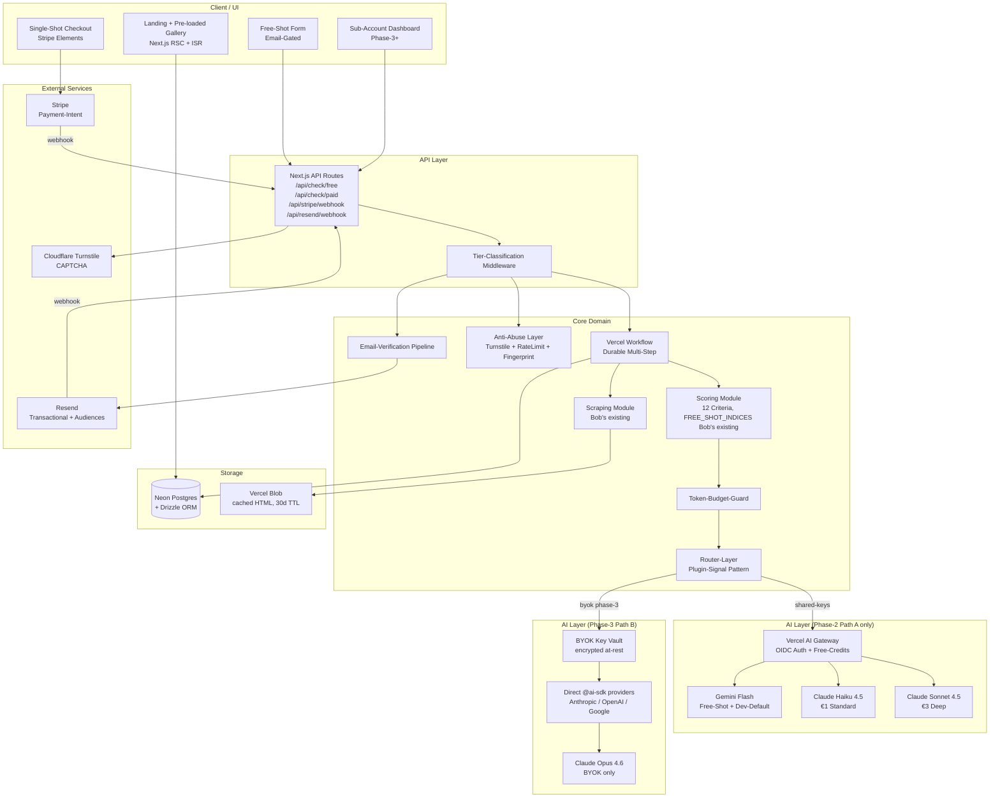
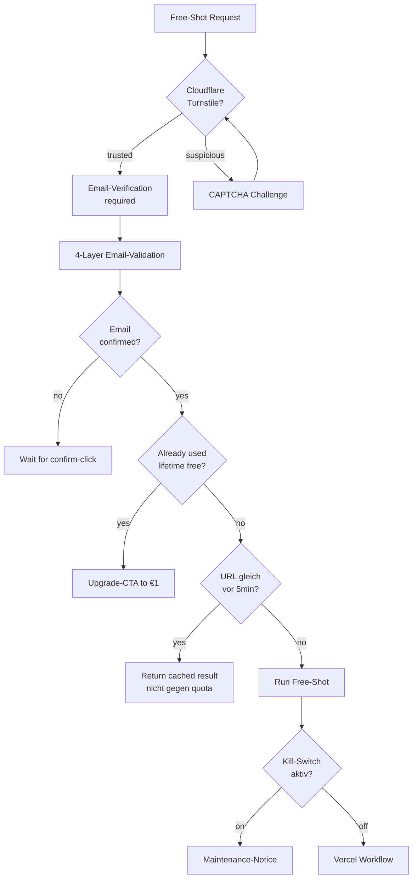
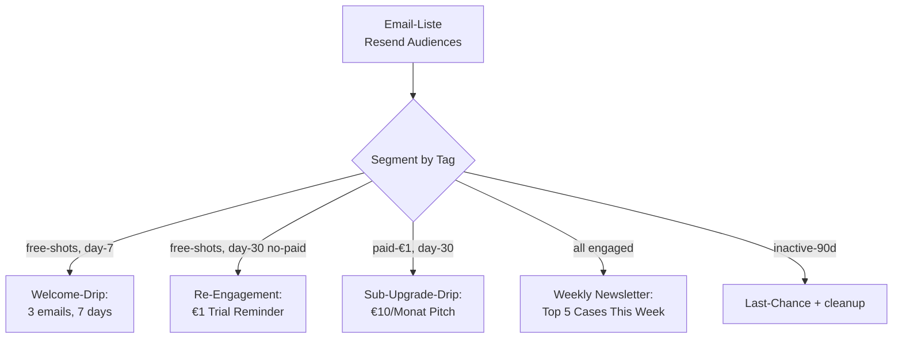
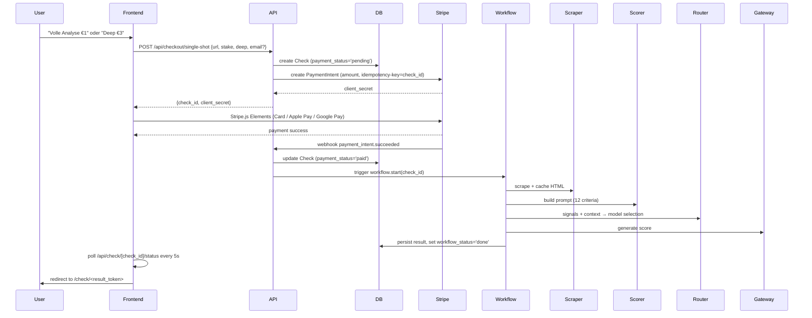
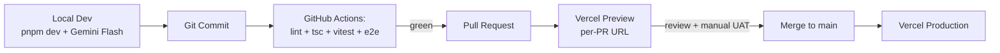

# Snake-Oil-Check — Tiered Architecture Design (v0.2)

**Date:** 2026-05-20
**Status:** Brainstorm-Approved, pending User Review-Gate before writing-plans transition
**Owner:** German Rauhut + MASCHIN (Brainstorming-Session Tag-61 letter-b)
**Supersedes:** [`docs/archive/2026-05-18-snakeoil-check-mmp-design.md`](../../archive/2026-05-18-snakeoil-check-mmp-design.md) (Pricing-Pivot: Shot-Bundles → Single-Shot + Sub + BYOK)
**Related Plan-Doc:** [`docs/superpowers/plans/phase-2-ai-workflow.md`](../plans/phase-2-ai-workflow.md) (Bob's Phase-2 Plan; Tasks 1-4 implemented via PRs #9 + #13; Tasks 5-10 will be re-scoped against this design)

---

## Pivot-Context (read first)

This design is the output of a brainstorming session held 2026-05-20 (letter-b). It pivots away from the 2026-05-18 MMP Spec's pricing-model (Shot-Bundles €19/€49) toward a Single-Shot-Per-Use (€1/€3) + Monthly Subscription (€10) + BYOK-Graduation model.

The product-vision, problem-statement, and scoring-framework from the 2026-05-18 spec remain valid. The pivot is on monetization, tier-architecture, customer-journey-mechanics, and technical-model-strategy.

**Phase-Scope Mapping:**

| Spec-Version | Phase | Status |
|--------------|-------|--------|
| v0.1 (Pricing-Pivoted) | Phase-2 MVP | Active build target |
| v0.2 (Tier 1.5 Deep + €3) | Phase-2 late | Same MVP cycle, late-Phase-2 add |
| v0.3 (Sub + BYOK) | Phase-3 | Post-MVP, ~4-8 weeks after launch |
| v0.4+ (B2B Enterprise) | Phase-4+ | Roadmap |

---

## 1. Vision + Funnel Architecture

**Product:** Neutral, AI-powered reality-check for online purchase-decisions on coachings, courses, masterclasses, high-ticket programs, and adjacent snake-oil-prone offerings (medical claims, financial promises, etc.).

**Customer Journey (5+1 Tiers):**

| Tier | Name | Pricing | Acquisition / Activation Role |
|------|------|---------|-------------------------------|
| 0 | Pre-loaded Examples Gallery | Free, no signup | Curated showcase of famous cases (Andrew Tate, Mindvalley, etc.) — proof-of-concept and SEO-engine |
| 0.5 | Free-Shot (Email-Gated) | Free, 1 per confirmed email (lifetime) | Activation: prove the tool works on user's URL of choice |
| 1 | Standard Single-Shot | €1, anonymous, Stripe Payment-Intent | **Conversion** — full 12-criteria analysis with Haiku-class model |
| 1.5 | Deep Single-Shot | €3, anonymous, Stripe Payment-Intent | Premium add-on — Sonnet-class model with bigger context budget for ambiguous cases |
| 2 | Subscription | €10/Monat, account-required | Retention — 50 checks/Monat included, history, alerts, batch-export |
| 3 | Subscription + BYOK | €10/Monat + Customer-paid Tokens | Graduation — Customer brings keys (Opus, multi-provider), unlimited checks, privacy-promise |
| 4 | B2B Enterprise | Custom (€100+/seat) | Roadmap — Bulk-API, Custom-Reports, SLA |

**Top Customer-Triggers (validated in brainstorm):**

1. **Ad-Confrontation** (TikTok / Instagram / YouTube): user sees ad → "Ist das Quatsch?" → checks before clicking through
2. **Pre-Purchase Verification**: user already in research-phase, checks 3-5 sites before €3K-5K commitment
3. (Secondary) **Defensive Recherche** for family/friends
4. (Secondary) **Reactive Vigilance** after being scammed once

**Customer-Segment Reality:** B2C-Mehrheit (Tier 0 → 0.5 → 1 → 2 → 3 PLG-Funnel) + B2B-Upside-Tier (Tier 4 für Versicherer / NGO / Verbraucherschutz) on top.

---

## 2. System Architecture Overview



**Layered Responsibilities:**

1. **Client/UI**: Next.js App (existing Phase-1). Three primary surfaces — Landing/Gallery (static + ISR), Free-Shot/Single-Shot Forms (anonymous), Subscriber Dashboard (Phase-3+).
2. **API Layer**: Next.js API Routes. Tier-Classification Middleware identifies request-class (anonymous / paid-anon / authenticated / b2b-token).
3. **Core Domain**: Router-Layer is heart — Plugin-Signal pattern selects Tier-1/Tier-2 model, Gateway/Direct path, Token-Budget. Vercel Workflow orchestrates durable Multi-Step (Scrape → Score → AI → Persist).
4. **AI Layer**: Path A (Phase-2) — all calls via Vercel AI Gateway with shared keys. Path B (Phase-3) — BYOK customers bypass Gateway and go direct via `@ai-sdk/<provider>` with decrypted customer-keys.
5. **Storage**: Neon Postgres (existing, Drizzle ORM) + Vercel Blob (HTML-cache 30d TTL).
6. **External**: Stripe (Payment-Intent flow), Resend (Transactional + Audiences for CRM), Cloudflare Turnstile (CAPTCHA).

---

## 3. Router-Layer Design

The central abstraction. Plugin-Signal pattern that selects model-tier + path + budget based on request-context.

### 3.1 Conceptual Schema

```typescript
// Input: what we know about the request
interface RouteSignals {
  customer_explicit_deep_analysis?: boolean   // Trigger B (MVP)
  stake_indicator?: 'low' | 'medium' | 'high' // Trigger D (MVP)
  domain_classifier_label?: string             // Trigger C (Phase-3 stub)
  tier1_confidence?: number                    // Trigger A (Phase-3 stub, post Tier-1)
}

interface RouteContext {
  tier: 'free-shot' | 'standard' | 'deep' | 'sub-no-byok' | 'sub-byok'
  customer_id?: string
  byok_config?: BYOKConfig     // Phase-3+ only
}

// Output: what to execute
interface RouteDecision {
  model_tier: 1 | 2
  provider: 'anthropic' | 'openai' | 'google'
  model_id: string
  key_source: 'shared' | 'byok'
  path: 'gateway' | 'direct'   // Phase-2: always 'gateway'
  token_budget: { input_max: number; output_max: number }
  gateway_tags?: string[]      // ['feature:snake-oil-check', 'tier:standard']
}
```

### 3.2 Tier-Selection Logic (Phase-2 MVP)

```typescript
function decideTier(signals: RouteSignals): 1 | 2 {
  if (signals.customer_explicit_deep_analysis === true) return 2  // Trigger B
  if (signals.stake_indicator === 'high') return 2                 // Trigger D
  // Phase-3 stubs (dead code in MVP, slot reserved):
  // if (signals.domain_classifier_label === 'medical-claims') return 2
  // if (signals.tier1_confidence != null && signals.tier1_confidence < 0.5) return 2
  return 1
}
```

**Stake-Slider behavior in MVP:**
- `low` / `medium` → Tier-1 default (Customer-Toggle can force Tier-2)
- `high` → automatic Tier-2 recommendation (Customer agrees or declines at checkout)

### 3.3 Path-Selection (Gateway vs Direct)

```typescript
function decidePath(context: RouteContext): 'gateway' | 'direct' {
  if (context.byok_config) return 'direct'  // Phase-3+ — privacy-promise
  return 'gateway'                           // Phase-2: all tiers via Gateway
}
```

### 3.4 Config-Source — env-driven Defaults

```bash
# Tier-1 Standard (default for €1 Single-Shot)
ROUTER_TIER1_PROVIDER=anthropic
ROUTER_TIER1_MODEL=claude-haiku-4.5

# Tier-2 Deep Analysis (default for €3 Single-Shot + Stake=High)
ROUTER_TIER2_PROVIDER=anthropic
ROUTER_TIER2_MODEL=claude-sonnet-4.5

# Free-Shot dedicated (Tier 0.5)
ROUTER_FREESHOT_PROVIDER=google
ROUTER_FREESHOT_MODEL=gemini-3-flash

# Dev override (.env.local — set all to Gemini Flash for free dev)
# ROUTER_TIER1_PROVIDER=google
# ROUTER_TIER1_MODEL=gemini-3-flash
# ROUTER_TIER2_PROVIDER=google
# ROUTER_TIER2_MODEL=gemini-3-flash

# Tier-2 Opus is BYOK-only (set ROUTER_TIER2_MODEL=claude-opus-4.6 in customer's BYOK config, Phase-3+)
```

### 3.5 Token-Budget per Tier

```typescript
const TOKEN_BUDGETS: Record<string, { input_max: number; output_max: number }> = {
  'free-shot': { input_max: 10_000, output_max: 1_500 },    // tight, Gemini Flash
  'tier-1':    { input_max: 30_000, output_max: 3_000 },    // €1 Standard, Haiku
  'tier-2':    { input_max: 50_000, output_max: 5_000 },    // €3 Deep, Sonnet
  'byok-opus': { input_max: 100_000, output_max: 8_000 },   // Phase-3+, Customer's Opus
}
```

**Pre-flight Budget-Check:** If estimated_input_tokens > budget.input_max, truncate to budget and add `warning_truncated: true` to CheckResult. User sees notice but check still runs.

### 3.6 File Layout

```
src/lib/router/
  index.ts              # main export, makeRouteDecision()
  types.ts              # all interfaces
  signals.ts            # signal-processing + Tier-Selection
  path.ts               # Gateway vs Direct (Phase-2: always Gateway)
  config.ts             # env-driven Config-Loader
  budget.ts             # Token-Budget-Guard + truncation
  __tests__/
    signals.test.ts
    config.test.ts
    budget.test.ts
    integration.test.ts
```

---

## 4. Pricing-Tier Implementation

### 4.1 Tier 0 — Pre-loaded Examples Gallery

**Implementation:**
- Curated set of 10-20 famous cases (Andrew Tate, Mindvalley, Lifecoaching brands, MLM-Pyramide-Examples)
- Pre-rendered checks persisted in DB with flag `is_curated_example = true`
- Re-Run cadence: Phase-2 manual via Admin-CLI, Phase-3 optional weekly Cron
- Frontend: ISR Next.js routes `/examples` (gallery) + `/examples/[slug]` (detail)

**API:**
```
GET /api/examples              # list curated examples (cached)
GET /api/examples/[slug]       # single example with full check-detail
```

**Cost-Impact:** Zero LLM-Cost at steady-state. Re-Runs are Admin-triggered.

**SEO-Strategy:** Each example-detail page is canonical "Is X a scam?" content — Google-rankable, long-tail-traffic engine.

### 4.2 Tier 0.5 — Free-Shot (Email-Gated)

**Flow:**
1. User enters URL + Stake-Slider on landing
2. API requires Email-Verification (see Section 7 — Anti-Abuse + Email-Verification)
3. After confirm-click, Workflow runs scoring on FREE_SHOT_INDICES = [1, 4, 7, 10, 11] with Gemini Flash
4. Result URL persisted, user redirected to `/check/<result_token>`
5. Result page shows 5 criteria + Upgrade-CTA "Volle 12-Kriterien-Analyse für €1"

**Lifetime-Limit:** 1 Free-Shot per confirmed email FOREVER (not per-30-days — simpler abuse-defense, clearer conversion-bridge).

**Cost per Free-Shot:** ~€0.022 (~€0.002 Gemini Flash tokens + €0.02 infra-share). Marketing-Spend per acquired Lead.

### 4.3 Tier 1 — €1 Standard Single-Shot (Anonymous)

**Flow:**
1. User triggers from Free-Shot upgrade-CTA OR direct landing-link
2. Stripe Payment-Intent created (€1.00, idempotency-key = check_id)
3. Stripe Elements collects card / Apple Pay / Google Pay
4. Webhook `payment_intent.succeeded` triggers Workflow.start(check_id)
5. Workflow runs: scrape → score (12 criteria) → AI via Router (Haiku 4.5 default) → persist
6. Frontend polls `/api/check/[check_id]/status` (5s interval)
7. Workflow done → frontend redirects to `/check/<result_token>`
8. Result page shows full 12-criteria analysis + email-share option (optional, no account needed)

**Result-Access:** Result-URL accessible 30 days. UUID-v4 token non-bruteforce-fähig (de-facto private unless user shares). Cookie remembers "your recent checks" within same browser.

**Anonymous = No Account Required.** Email collection optional at checkout (for receipt + result-link backup).

### 4.4 Tier 1.5 — €3 Deep Single-Shot (Anonymous)

Same flow as Tier 1, but:
- Customer pre-selects "Deep Analysis" toggle ON OR Stake-Slider = High
- Stripe Payment-Intent is €3.00 instead of €1.00
- Router routes to Tier-2 (Sonnet 4.5 default, 50K input-budget)
- Result page has slightly richer detail (longer evidence-quotes, more reasoning per criterion)

### 4.5 Tier 2 — Subscription (Phase-3+)

**Out of Phase-2 MVP scope.** Designed-but-not-built.

- Account-required (email + magic-link, no password — same Resend-based pattern)
- €10/Monat via Stripe Subscription
- 50 checks/Monat included (mix of Standard + Deep, customer chooses per check)
- Dashboard: history, search, batch-export-CSV
- Quota-tracking in DB (`subscription_quotas` table)

### 4.6 Tier 3 — Subscription + BYOK (Phase-3+)

**Out of Phase-2 MVP scope.** Designed-but-not-built.

- All Tier-2 features
- Plus: Customer adds own Anthropic / OpenAI / Google API-Keys via account-settings
- Keys encrypted at-rest (Vault), decrypted per-request
- Router uses customer's keys via Direct-Path (`@ai-sdk/<provider>`, no Gateway)
- Unlimited checks (no quota — Customer pays own tokens)
- **Opus 4.6 only available via BYOK** — strategic positioning: maximum-tier requires customer engagement (own key + own cost)

### 4.7 Tier 4 — B2B Enterprise (Roadmap)

**Phase-4+ scope.** Mentioned only for architecture-readiness.

- Bulk-API (API-token auth)
- Custom-Reports (white-label)
- SLA-guarantees
- Per-seat pricing (€100+/seat)

---

## 5. Data Model (Drizzle Schema)

### 5.1 Phase-2 MVP Tables

```typescript
// checks — main table for all Tiers
{
  id: uuid (PK)
  result_token: uuid (UNIQUE)              // public URL identifier
  url: text                                // input URL
  url_normalized: text                     // for de-dup
  tier: enum('free-shot', 'standard', 'deep', 'example')
  stake_indicator: enum('low', 'medium', 'high') | null
  deep_analysis_requested: boolean
  payment_status: enum('not-required', 'pending', 'paid', 'failed', 'refunded')
  stripe_payment_intent_id: text | null
  payment_intent_amount_cents: int | null
  scrape_status: enum('pending', 'done', 'failed')
  scrape_html_blob_url: text | null        // Vercel Blob URL
  workflow_status: enum('pending', 'running', 'done', 'failed')
  workflow_error: text | null
  model_provider: text                      // 'google', 'anthropic'
  model_id: text                            // 'gemini-3-flash', 'claude-haiku-4.5'
  token_budget_used_input: int | null
  token_budget_used_output: int | null
  llm_cost_eur_cents: int | null            // analytics
  is_curated_example: boolean (default false)
  example_slug: text | null                 // Tier-0 URL slug
  ip_hash: text | null                      // Free-Shot rate-limit
  cookie_session: text | null               // anonymous result-cookie
  email_subscriber_id: uuid | null          // FK if user opted in for marketing
  created_at: timestamp
  expires_at: timestamp                     // 30d for paid, 90d for examples, null for paid-with-email
}

// check_results — separate table for structured score-data
{
  id: uuid (PK)
  check_id: uuid (FK → checks)
  criteria_scored: int                     // 5 for free-shot, 12 for paid
  total_score: int                         // 0-80 weighted sum
  tendency: enum('green', 'amber', 'red')  // 75/45 buckets per Bob's criteria.ts
  criteria_scores: jsonb                    // [{criterion_id, score, reasoning, evidence_quote}]
  warning_truncated: boolean
  raw_llm_response: jsonb | null            // debug-only, purgeable after 7d
  created_at: timestamp
}

// curated_examples — Tier 0 gallery
{
  slug: text (PK)
  check_id: uuid (FK → checks)
  title: text
  category: text                            // 'mlm', 'health-coach', 'crypto', 'investment'
  display_order: int
  is_published: boolean
  curated_summary: text                     // editorial intro
  created_at: timestamp
  updated_at: timestamp
}

// email_verifications — Tier 0.5 Free-Shot gating
{
  id: uuid (PK)
  email: text (UNIQUE, lowercase normalized)
  ip_hash: text                             // signup-IP
  signup_token: uuid                        // Frontend ↔ API correlation
  confirm_token: uuid                       // magic-link in email
  status: enum('pending', 'confirmed', 'expired', 'bounced', 'rejected')
  bounce_reason: text | null
  rejection_reason: enum('disposable', 'no_mx', 'rate_limit') | null
  free_shot_used: boolean                   // 1 free-shot lifetime per confirmed email
  expires_at: timestamp                     // +1h from creation
  confirmed_at: timestamp | null
  created_at: timestamp
}

// email_subscribers — Marketing list (Phase-2 collect, Phase-3 send)
{
  id: uuid (PK)
  email: text (UNIQUE)
  resend_contact_id: text                   // sync with Resend Audiences
  source: enum('free-shot', 'paid-€1', 'paid-€3', 'landing-form')
  marketing_consent: boolean                // separate from transactional
  consent_timestamp: timestamp
  consent_ip_hash: text                     // GDPR audit-trail
  tags: text[]                              // ['tier:free', 'segment:research-phase']
  status: enum('active', 'unsubscribed', 'bounced', 'complained')
  last_engagement: timestamp | null
  created_at: timestamp
}

// rate_limits — anti-abuse counters
{
  ip_hash: text (PK part)
  resource: enum('free_shot', 'email_signup')  (PK part)
  date: date (PK part)
  count: int
}
```

### 5.2 Phase-3+ Tables (Schema-Stubs)

```typescript
// users — Phase-3
{ id, email, magic_link_token, created_at, ... }

// subscriptions — Phase-3
{ user_id, stripe_subscription_id, plan, status, current_period_end, ... }

// subscription_quotas — Phase-3
{ user_id, period_start, checks_used, checks_remaining, ... }

// byok_configs — Phase-3
{ user_id, provider, encrypted_key, tier1_model, tier2_model, ... }

// api_tokens — Phase-4 (B2B)
{ org_id, token_hash, scopes, created_at, ... }
```

Phase-2 keeps these table-stubs out — added when Phase-3 starts. Migration-strategy: additive only.

### 5.3 Indexes / Performance

- `checks.result_token` UNIQUE INDEX (public URL lookup)
- `checks.url_normalized` INDEX (Free-Shot de-dup within 5min cache)
- `checks.payment_status WHERE 'pending'` partial INDEX (webhook fast-lookup)
- `checks.is_curated_example, expires_at` (gallery query)
- `rate_limits (ip_hash, resource, date)` composite PK
- `curated_examples.is_published, display_order` (gallery render)

---

## 6. Cost + Margin Analysis

### 6.1 Token-Cost-Modellierung (Vercel-Gateway-Rates 2026, geschätzt)

| Modell | Input $/M tokens | Output $/M tokens | Notiz |
|--------|------------------|-------------------|-------|
| Gemini 3 Flash | $0.10 | $0.40 | Free-Credits decken Großteil |
| Claude Haiku 4.5 | $1.00 | $5.00 | Tier-1 Standard (€1) |
| Claude Sonnet 4.5 | $3.00 | $15.00 | Tier-2 Deep (€3) |
| Claude Opus 4.6 | $15.00 | $75.00 | BYOK-only |

### 6.2 Token-Verbrauch pro Check (Estimates)

| Check-Typ | Input Tokens | Output Tokens | Modell |
|-----------|--------------|---------------|--------|
| Free-Shot (5 Kriterien) | ~10,000 | ~1,500 | Gemini Flash |
| Tier-1 Standard (12 Kriterien) | ~30,000 | ~3,000 | Haiku 4.5 |
| Tier-2 Deep (12 Kriterien) | ~50,000 | ~5,000 | Sonnet 4.5 |
| Tier-3 BYOK Opus (12 Kriterien) | ~50,000 | ~5,000 | Opus 4.6 (Customer's cost) |

### 6.3 Kosten pro Check (€-Beträge, Umrechnung 1:1 USD/EUR vereinfacht)

| Position | Free-Shot | Tier-1 Standard (€1) | Tier-2 Deep (€3) | BYOK Opus (€10/Monat-Sub) |
|----------|-----------|----------------------|-------------------|----------------------------|
| Input-Token-Kosten | €0.001 | €0.030 | €0.150 | €0 (Customer paid) |
| Output-Token-Kosten | €0.001 | €0.015 | €0.075 | €0 (Customer paid) |
| **LLM-Cost Summe** | **€0.002** | **€0.045** | **€0.225** | **€0** |
| Stripe-Fee (€0.25 fix + 1.5%) | — | €0.265 | €0.295 | (Sub-recurring, anders) |
| Infrastructure-Share (Vercel/Neon/Blob, ~€0.02/check) | €0.020 | €0.020 | €0.020 | €0.020 |
| **Total Cost** | **€0.022** | **€0.330** | **€0.540** | **€0.020** |

### 6.4 Revenue + Margin

| Tier | Revenue | Total Cost | Gross Margin | Margin-% |
|------|---------|------------|--------------|----------|
| Free-Shot (lifetime per email) | €0.00 | €0.022 | **−€0.022** | Marketing-Spend |
| Tier-1 Standard (€1) | €1.00 | €0.330 | **+€0.670** | **67%** |
| Tier-2 Deep (€3) | €3.00 | €0.540 | **+€2.460** | **82%** |
| Tier-3 BYOK Opus per check | €0 (Sub covers) | €0.020 | ~Sub-revenue | ~95% per-check (after Sub-Cost) |

### 6.5 Beobachtungen + Empfehlungen

1. **Free-Shot Marketing-Spend tragbar**: Lifetime-1-per-email + Anti-Abuse-Layers → durchschnittlich ~1 Free-Shot pro Unique-Email ≈ €0.022/Lead. Vergleichbar mit Facebook-CPC (€0.50-2.00), aber besseres Intent-Signal.

2. **Tier-1 (€1) Margin 67%** ist gesund. Stripe-Fix-Fee frisst 27% — wenn Pricing auf €1.49 angehoben würde, springt Margin auf ~75%. €1 ist psychologisch der "trial price point", aber Stripe-Fee-Reality.

3. **Tier-2 (€3) Margin 82%** sehr stark. Deep-Analysis ist die echte Margin-Driver.

4. **Opus-only-via-BYOK** ist Positionierung-Gold: Customer-Engagement (own key) ist Eintrittspreis für maximum-tier. Wir tragen kein Cost-Risk für Opus.

5. **Cross-Model-Benchmark als Phase-2 Task 5b** (NEU im Plan): empirisch validieren ob Haiku-4.5 für Standard-Tier ausreicht. Wenn nicht, Pricing-Reset auf €1.49 mit Sonnet für Standard.

6. **Conversion-Break-Even** für Free-Shot → €1: ~2.2% Konversion (€0.022 cost × 50 Free-Shots = €1.10 vs €1.00 revenue). Realistic-Target: 3-5%.

---

## 7. Anti-Abuse Sub-System + Email-Verification

### 7.1 Threat-Modell

| Threat | Defense Layer |
|--------|----------------|
| IP-Rotation (VPN, Proxy) | Browser-Fingerprint + Geo-Velocity-Heuristik |
| Browser-Fingerprint-Reset (Inkognito) | Email-Gating + Lifetime-Limit per confirmed email |
| Botnets | Cloudflare Turnstile + Email-Verification |
| CGNAT False-Positive | Cookie + Email-distinction over IP-only |
| Email-Farming | IP-RateLimit on Email-Signup (3/24h) + Disposable-Detection |
| Email-Bounce-Abuse (fake addresses) | Resend Bounce-Webhook + Block-on-hard-bounce |

### 7.2 Free-Shot Anti-Abuse Pipeline



### 7.3 Email-Validation 4-Layer Pipeline

1. **Layer 1 — Disposable-Email Detection**: Static blocklist (~10k domains from [disposable-email-domains](https://github.com/disposable-email-domains/disposable-email-domains)). Build-time bundled. Weekly auto-update via GitHub-Action.

2. **Layer 2 — MX-Lookup**: `dns.resolveMx(domain)` — catches typos (gmial.com) + made-up domains.

3. **Layer 3 — IP-Rate-Limit**: Max 3 email-signups / 24h per IP-hash.

4. **Layer 4 — Resend Bounce-Detection**: Webhook listens for `email.bounce` (hard) + `email.complaint` → marks `email_verifications.status='bounced'` + blocks future Free-Shots from this email.

### 7.4 Wait-Page Conversion-Trick

While user waits for email-confirm-click (30sec - 2min):
- Show pre-loaded Examples Gallery (browse-while-waiting)
- "Don't want to wait? Skip ahead → €1 Full Analysis instantly" with Stripe-Quick-Pay-Button
- Email-Resend option
- Progress-Indicator

**Insight:** The Wait-Page IS the Conversion-Page for impatient users. Email-Gated Free-Shot is structurally a higher-friction-but-higher-conversion funnel.

### 7.5 Phase-2 MVP Anti-Abuse Layers

- ✅ Cloudflare Turnstile (Layer 1, basic)
- ✅ IP+Cookie Rate-Limit (Layer 2)
- ✅ URL-Dedup 5min (Layer 5)
- ✅ Kill-Switch env-var (Layer 6, `FREE_SHOT_ENABLED=true|false`)
- ❌ Browser-Fingerprint (Layer 3, Phase-3 — needs calibration data first)
- ❌ Geo-Velocity (Layer 4, Phase-3 — needs calibration data first)

---

## 8. Marketing-Architecture

### 8.1 Phase-2 MVP — Resend Audiences List-Building only

Existing Phase-1 stack already has Resend for transactional emails. Phase-2 adds Resend Audiences (native CRM-light, 2026-launched).

**What Phase-2 does:**
1. **Transactional Emails**: Free-Shot-Confirm, Result-Link, €1-Receipt — Resend basic
2. **List-Building**: Each confirmed Free-Shot-Signup lands in `free-shots` Audience. Each €1-Customer lands in `paid` Audience.
3. **GDPR Double-Opt-In**: Separate checkboxes at signup for transactional (required) + marketing (optional).
4. **NO proactive Newsletter yet** — Phase-2 collects warmth, Phase-3 ignites.

### 8.2 Phase-3 (Post-MVP, 4-8 Wochen nach Launch) — Newsletter Engine



### 8.3 Content-Marketing-Flywheel (Phase-3 strategic insight)

Snake-Oil-Check produziert Content als Byproduct: jeder Check mit Red-Flag-Tendency wird (anonymisiert + editorialized) zum Newsletter-Feature → Blog-Post → SEO-Ranking → Google-Traffic → Tool-Nutzung → mehr Checks → mehr Content.

Selbstverstärkender Loop: Tool nutzen → Daten → Content → Traffic → Tool nutzen.

### 8.4 GDPR-Compliance

Signup-Form muss **zwei separate Checkboxen** haben:

1. ✅ "Ich akzeptiere die Verarbeitung meiner Email für diesen Free-Check" (transactional, required — legitimate interest per GDPR Art. 6(1)(b))
2. ☐ "Ich möchte den Snake-Oil-Check Newsletter erhalten" (marketing, optional — explicit consent per GDPR Art. 6(1)(a))

Unsubscribe-Link in every marketing email (GDPR Art. 21 + ePrivacy). Resend Audiences handles this natively.

---

## 9. Stripe Integration

**Pattern:** Stripe **Payment-Intent** (not Checkout-Session) for €1 / €3 Single-Shots. Lower fee, embedded UX.

### 9.1 Flow



### 9.2 Idempotency

Stripe-Idempotency-Key = `check_id`. Double-clicks on "Pay" don't create duplicate PaymentIntents. Webhook handler idempotent on `payment_intent_id` (re-runs are no-ops).

### 9.3 Webhook-Security

Verify Stripe-Signature-Header against `STRIPE_WEBHOOK_SECRET` in Vercel-env. Standard Stripe-Docs pattern.

### 9.4 Test-Mode

`sk_test_*` for Local-Dev + Preview-Deployments. `sk_live_*` only in Production-env. Vercel-env-Scope handles this naturally.

### 9.5 Refunds (Edge Cases)

- Scrape-Failure (URL unreachable, timeout): auto-refund via Stripe API
- Workflow-Failure (LLM down, retry-exhausted): auto-refund + email "We couldn't analyze this URL, full refund issued"
- User-Dispute: manual via Stripe Dashboard (Phase-2 no self-service refund)

---

## 10. Error-Handling

| Fehlerklasse | Wo | Behandlung |
|--------------|------|------------|
| LLM Token-Budget exceeded | Router/Budget-Layer | Content auto-truncate + warning-flag in CheckResult |
| LLM-Provider unreachable | Workflow Step | Retry × 3 with backoff (Vercel Workflow native). After failure: Refund + email |
| Stripe Webhook delivery delay | Webhook-Handler | Stripe-Retry × 3 native. Frontend polls independently on Check-Status |
| Vercel Workflow step-failure | Workflow-Layer | Durable resume from last good step. State persists in Workflow-Storage |
| Email-Bounce (hard) | Resend Webhook → DB | `email_verifications.status='bounced'`, future Free-Shots blocked |
| URL not reachable (404, timeout) | Scraping-Layer | Bob's existing handling: error-state in Check, user sees "URL unreachable, no charge" + Stripe auto-refund |
| Stake-Slider missing | API-validation | 422 Schema-error before Workflow-Start |
| Free-Shot abuse detected | Anti-Abuse-Layer | 429 + log + possibly fingerprint-block |
| Disposable-Email submitted | Email-Validation Layer 1 | 400 "Please use a real email address" |
| MX-record missing | Email-Validation Layer 2 | 400 "Email domain not deliverable — typo?" |

**User-Facing Error-Messages:** Always actionable. "URL nicht erreichbar — bitte URL prüfen + nochmal versuchen (kein Charge entstanden)." NICHT: "Internal Server Error 500."

---

## 11. Testing Strategy

| Test-Schicht | What | Tools | Bob's existing? |
|--------------|------|-------|-----------------|
| Unit | Router-logic, signal-processing, budget-truncation, scoring-rubric, scraping | Vitest + vi.mock + vi.hoisted | ✅ 45/45 (Tasks 1-4) |
| Integration | Workflow + DB + Resend (test-mode) + Stripe (test-mode) | Vitest + Drizzle test-DB | ⏳ Phase-2 Task 7 |
| E2E | Free-Shot full flow + €1 full flow + Result-page rendering | Playwright + Vercel-Preview | ⏳ Phase-2 Task 9 |
| Cross-Model Benchmark | Haiku vs Sonnet vs Gemini Flash on 5 Eval-URLs | Bob's existing §8 #1 + NEW Task 5b | ⏳ Phase-2 Task 5+5b |
| Manual UAT | Examples Gallery rendering, Email-flow real-test, Stripe Test-Cards | Manual + Playwright-recording | After Tasks 7-9 |

**Bob's Test-Discipline carries over**: failing-test-first, mocks-at-boundary, vi.hoisted für ESM-hoisting.

---

## 12. Dev/Prod Configuration

### 12.1 Env-Variable Matrix

| Variable | Dev (.env.local) | Preview | Production |
|----------|------------------|---------|------------|
| `ROUTER_TIER1_PROVIDER` | `google` | `anthropic` | `anthropic` |
| `ROUTER_TIER1_MODEL` | `gemini-2.0-flash` | `claude-haiku-4-5` | `claude-haiku-4-5` |
| `ROUTER_TIER2_PROVIDER` | `google` | `anthropic` | `anthropic` |
| `ROUTER_TIER2_MODEL` | `gemini-2.0-flash` | `claude-sonnet-4-5` | `claude-sonnet-4-5` |
| `ROUTER_FREESHOT_MODEL` | `gemini-2.0-flash` | `gemini-2.0-flash` | `gemini-2.0-flash` |
| `FREE_SHOT_ENABLED` | `true` | `true` | `true` (kill-switch flippable) |
| `FREE_SHOT_LIFETIME_LIMIT` | `99` (dev) | `1` | `1` |
| `EMAIL_VERIFICATION_REQUIRED` | `false` (dev skip) | `true` | `true` |
| `STRIPE_SECRET_KEY` | `sk_test_*` | `sk_test_*` | `sk_live_*` |
| `STRIPE_WEBHOOK_SECRET` | (test) | (test) | (live) |
| `RESEND_API_KEY` | `re_test_*` | `re_test_*` | `re_live_*` |
| `DATABASE_URL` | local PG or Neon-dev-branch | Neon-preview-branch | Neon-main |
| `ANTHROPIC_API_KEY` | (optional, keychain pipe) | (Vercel-env) | (Vercel-env) ✅ set 2026-05-20-b |
| `TURNSTILE_SITE_KEY` | test-key | test-key | live-key |
| `TURNSTILE_SECRET_KEY` | test-key | test-key | live-key |

### 12.2 Deployment Pipeline (existing Phase-1 setup)



---

## 13. Project-Management Approach

**Solo + AI = lightweight tooling. No bureaucracy.**

| Tool | Purpose | Decision |
|------|---------|----------|
| GitHub Issues | Mobile-Capture + Ticket-Tracking | ✅ Use (existing pattern from omnopsis-planning) |
| Plan-Docs (this design + writing-plans output) | Sprint-Planning + Architecture-Decisions | ✅ Use (this is the design-doc convention) |
| Session-Reports YAML | Daily Journal + Status-Tracking | ✅ Use (existing pattern) |
| Development-Diary | Day-by-day narrative | ✅ Use (existing in omnopsis-planning) |
| Slack | Human-to-Human channel | ❌ Skip (Solo = no value) — revisit at team-of-2+ |
| Jira | Enterprise ticket-mgmt | ❌ Skip (GitHub Issues + Plan-Docs cover) |
| Notion / Linear public board | Roadmap-Sichtbarkeit external | ⏳ Optional Phase-3, marketing-layer (not PM) |
| Build-in-Public X/LinkedIn posts | Marketing-Flywheel | ⏳ Optional, marketing not PM |

**Omnopsis-Dogfood-Loop (passive, no extra work):**

Snake-Oil-Check development produces natural artifacts (Plan-Docs, Session-Reports, Diary, Decision-Logs, Cross-Repo-Workflow-State). Omnopsis (the user's primary product) can ingest these as real-world test-data without any extra bureaucracy on Snake-Oil's side. Self-feeding loop.

---

## 14. Phase Roadmap

### 14.1 Phase-2 MVP Scope (this design)

**Already Done (Bob's PR #9 + #13):**
- ✅ Pre-flight + Dependencies (Bob's Task 1)
- ✅ 12-Criteria Scoring Rubric + FREE_SHOT_INDICES (Bob's Task 2)
- ✅ Scraping Module (Bob's Task 3)
- ✅ AI Gateway Client + 2 Strategies (single-call + per-criterion) (Bob's Task 4)

**To Build (re-scoped from Bob's Tasks 5-10):**
- 🔲 Router-Layer (NEW — extends Bob's strategies)
- 🔲 Cross-Model Benchmark Task 5b (NEW — Haiku vs Sonnet vs Gemini Flash)
- 🔲 Strategy Benchmark Task 5 (Bob's existing §8 #1 — single-call vs per-criterion on Sonnet)
- 🔲 DB Migrations: checks, check_results, curated_examples, email_verifications, email_subscribers, rate_limits
- 🔲 Vercel Workflow durable pipeline (Bob's Task 7)
- 🔲 Email-Verification Pipeline (Layer 1-4)
- 🔲 Resend Audiences integration (List-Building only)
- 🔲 Anti-Abuse: Cloudflare Turnstile + RateLimit + URL-Dedup + Kill-Switch
- 🔲 Stripe Payment-Intent integration (Tier 1 + Tier 1.5)
- 🔲 Frontend: Landing/Gallery, Free-Shot Form (with Email-Gate), €1/€3 Checkout, Result Page
- 🔲 Curated Examples Gallery (Tier 0, manual curation + Admin-CLI for re-runs)
- 🔲 E2E Test Coverage (Bob's Task 9)
- 🔲 CI Verification (Bob's Task 10)

### 14.2 Phase-3 (Post-MVP, 4-8 Wochen nach Launch)

- 🔲 User Accounts (Magic-Link Auth, no password)
- 🔲 Subscription Tier (€10/Monat, Stripe Subscriptions)
- 🔲 BYOK Tier (Customer-Keys encrypted-at-rest, Direct-Path routing)
- 🔲 Subscription Dashboard (history, search, batch-export)
- 🔲 Newsletter Engine (Welcome-Drip, Weekly-Digest, Re-Engagement)
- 🔲 Content-Pipeline (Auto-Generated Top-5-Cases-Weekly from DB)
- 🔲 Advanced Anti-Abuse: Browser-Fingerprint + Geo-Velocity
- 🔲 Tier-2 Auto-Escalation (Trigger A: System-Confidence)
- 🔲 Domain-Classifier (Trigger C: Medical / Financial / MLM auto-recommendation)

### 14.3 Phase-4+ (3-6 Monate post-Launch)

- 🔲 B2B Enterprise Tier (Bulk-API, API-Tokens, Custom-Reports, SLA)
- 🔲 Programmatic SEO (per-domain landing pages, Phase-3-content)
- 🔲 Self-Service Refund + Account-Mgmt
- 🔲 DE/EN i18n
- 🔲 Mobile-App (if traction warrants)

### 14.4 Explicitly Out-of-Scope (no Phase commitment)

- ❌ Real-time monitoring of submitted URLs ("alert me if this page changes")
- ❌ Custom-Branding / White-Label (until B2B-volume warrants)
- ❌ Multi-language i18n (DE-only at launch)
- ❌ User-submitted comments / community-discussion ("snake-oil-reddit" anti-pattern)
- ❌ Marketplace for human reviewers (out of product-scope)

---

## 15. Open Questions

Logged here for resolution during writing-plans phase or Phase-2 implementation:

1. **Curated Examples — wer kuratiert?** Manual editorial decision. User-self? Outsourced? Phase-2 manual via Admin-CLI, Phase-3 maybe automate from real high-red-flag checks.

2. **Cross-Model Benchmark Eval-Set** — Bob's report mentions 5 URLs hand-pick needed (T-USER-4). This must happen before Task 5+5b. Categories: 2 Gold (legit coaching, e.g. ICF-certified) + 2 Snake-Oil (medical-pseudoscience, crypto-pyramide) + 1 Ambiguous (borderline lifestyle coach).

3. **Stripe-Fee €1-Pricing-Reality** — €0.265 Stripe-Fee on €1 = 27% take. If post-MVP data shows €1 conversion is high but unit-margins thin, consider €1.49 pricing.

4. **Tier-2 Model Validation** — Sonnet 4.5 default for Deep. If Bob's Cross-Model-Benchmark (Task 5b) shows Haiku 4.5 already differentiates strongly for ambiguous cases, Tier-2 could downgrade to Haiku-with-bigger-context and reprice.

5. **Result-URL Sharing Mechanics** — Currently UUID-v4 non-bruteforce-fähig but anyone-with-link sees content. Phase-3 Sub could add "Make Private" toggle. Phase-2 ships open-by-link.

6. **Anti-Abuse Calibration Data** — Browser-Fingerprint + Geo-Velocity (Phase-3) need real abuse-pattern data to calibrate. Phase-2 collects logs without enforcement, Phase-3 enables enforcement once patterns are clear.

7. **Free-Shot Lifetime — wirklich forever?** "1 per email lifetime" is aggressive. Alternative: "1 per email per 90 days" (allows seasonal re-use). MVP starts with `lifetime`, can relax later via env-var change.

8. **Tier-1 (€1) vs Tier-1.5 (€3) UX Distinction** — when user enters URL on landing, do they see two buttons ("€1 Standard" + "€3 Deep") or one button with toggle? UX-decision deferred to wireframing-phase.

9. **GDPR DPO Pre-Launch Audit** — recommended before going live (per global CLAUDE.md, Dr. Sommer agent available). Schedule as Phase-2 closing-task.

10. **AD-33 Compliance Audit Free-Shot Email-Flow** — Email-Verification handles secrets (confirm-tokens), need to verify AD-33 pipe-pattern compliance where applicable.

11. **Bob's gateway.ts Multi-Model Refactor** — Currently single-model (Sonnet 4.5 hardcoded per PR #13). Router-Layer requires multi-model — `gateway.ts` must accept `provider` + `model_id` parameter and dynamically instantiate the appropriate `@ai-sdk/<provider>` client. Small refactor (~30min Bob-time), but blocks Router-Layer integration. Schedule as Phase-2 Task 5-prerequisite.

---

## 16. Approval-Trail

| Date | Approver | What |
|------|----------|------|
| 2026-05-20 | German Rauhut (User) | Architecture C-Hybrid + 5-Tier model + Email-Gated Free-Shot + Resend Audiences List-Building + Opus-via-BYOK positioning |
| 2026-05-20 | MASCHIN (Brainstorming Skill) | Structured brainstorm of 8+ clustered questions, 3-approach proposal, section-by-section design |
| TBD | German Rauhut (Review-Gate) | This document approved for writing-plans transition |

---

**End of Design Doc v0.2.**

Next step per Brainstorming-Skill: User-Review-Gate → if approved, transition to `writing-plans` skill to produce detailed implementation plan that re-scopes Bob's Phase-2 Tasks 5-10 against this design.
